# WashPro — Application Flow Documentation

**Project Name:** WashPro  
**Document Type:** `appflow.md`  
**Version:** 1.0  
**Status:** Proposed  
**Application Type:** Responsive Car Wash Management Web Application  
**Primary Users:** Admin and Staff  
**Primary Devices:** Mobile phones, tablets, laptops, and desktop computers  

---

## 1. Purpose of This Document

This document defines the complete user flow, navigation flow, screen-to-screen movement, status transitions, validation behaviour, permission checks, and major success or failure paths for the WashPro application.

The purpose of `appflow.md` is to ensure that:

- Every user action has a clear next step.
- Admin and Staff users see only the features permitted for their roles.
- The complete car wash process can be completed with minimal confusion.
- Live vehicle photos, GPS data, services, discounts, timers, payments, and invoices remain connected to the correct wash job.
- Errors, denied permissions, interrupted internet connections, invalid discounts, and incomplete payments are handled safely.
- Developers, designers, testers, and the client understand how the application should behave before implementation.

---

## 2. Core Application Flow

The main operational journey is:

```text
Login
  ↓
Staff Home / Admin Dashboard
  ↓
Search or Register Customer
  ↓
Select or Add Vehicle
  ↓
Create New Wash Job
  ↓
Capture Live Vehicle Photo
  ↓
Capture GPS Location
  ↓
Select Service and Add-ons
  ↓
Apply Coupon or Referral Code
  ↓
Review Price
  ↓
Create Job
  ↓
Waiting / Start Wash
  ↓
Timer: Start → Pause → Resume → End
  ↓
Review Final Bill
  ↓
Record Payment
  ↓
Generate Invoice
  ↓
Download / Print / Share through WhatsApp
  ↓
Update Customer, Vehicle, Revenue, Referral, and Wash History
```

---

## 3. User Roles and Entry Points

## 3.1 Admin Entry Flow

The Admin enters the system through the Login screen.

After successful login, the Admin is redirected to the **Admin Dashboard**.

The Admin can access:

- Dashboard
- Active Wash Jobs
- Customers
- Vehicles
- Services
- Vehicle-Type Pricing
- Staff Management
- Coupons
- Referrals
- Payments
- Invoices
- Expenses
- Reports
- Business Settings
- Location Settings
- Audit Logs
- Profile
- Logout

The Admin may also create customers, vehicles, and wash jobs when required.

---

## 3.2 Staff Entry Flow

A Staff user enters the system through the same Login screen.

After successful login, the Staff user is redirected to the **Staff Home**.

The Staff user can access:

- Staff Home
- New Wash
- Active Jobs
- Customer Search
- Customer Registration
- Vehicle Search
- Wash History
- Invoice Search
- Profile
- Logout

Staff users must not see restricted Admin-only sections unless the Admin has explicitly granted permission.

---

## 3.3 Disabled Account Flow

```text
User enters login details
  ↓
System finds account
  ↓
Account status is checked
  ├── Active → Continue login
  └── Disabled → Block login
                 Show: "Your account is disabled. Contact the administrator."
                 Record failed login attempt
```

---

## 4. Global Navigation Structure

## 4.1 Mobile Navigation

On mobile devices, the interface should use:

- A top header with page title.
- A menu button for secondary pages.
- A bottom navigation bar for frequent Staff actions.
- Large touch-friendly buttons.
- Sticky primary action buttons when appropriate.

Recommended Staff bottom navigation:

1. Home
2. New Wash
3. Active Jobs
4. Customers
5. More

Recommended Admin bottom navigation:

1. Dashboard
2. Jobs
3. Customers
4. Reports
5. More

---

## 4.2 Tablet and Desktop Navigation

On tablets and desktops, the interface should use:

- A left sidebar.
- A top header.
- Breadcrumbs for nested pages.
- A user profile menu.
- A content area with cards, tables, forms, and filters.

The sidebar should collapse on smaller screens.

---

## 4.3 Global Header Actions

The header may include:

- Current page title
- Branch or business name
- Search
- Active job count
- Notification indicator
- Logged-in user name
- Profile
- Change password
- Logout

---

## 5. Authentication Flow

## 5.1 Login Screen

### Fields

- Username, email, or phone number
- Password
- Show or hide password
- Remember session, optional
- Login button
- Forgot password, optional

### Flow

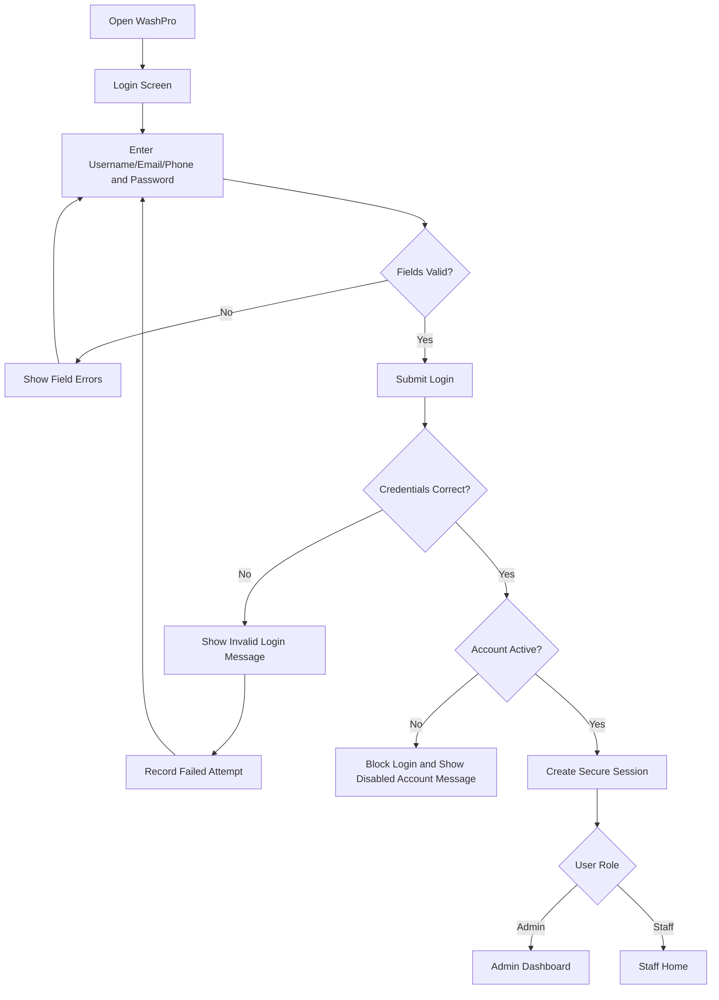

### Login Validation

- All required fields must be completed.
- Password must not be shown in plain text by default.
- Disabled users must be blocked.
- Repeated failed attempts may trigger temporary rate limiting.
- Login activity should be recorded.

---

## 5.2 Logout Flow

```text
User opens profile menu
  ↓
User selects Logout
  ↓
System asks for confirmation if a form or active draft is open
  ↓
Session is destroyed
  ↓
User returns to Login screen
```

---

## 5.3 Session Expiry Flow

```text
User remains inactive beyond configured timeout
  ↓
Session expires
  ↓
Next protected action is blocked
  ↓
Show: "Your session has expired. Please log in again."
  ↓
Redirect to Login
```

Unsaved form information may be temporarily preserved where safe.

---

## 6. Staff Home Flow

The Staff Home screen is the main operational starting point.

## 6.1 Staff Home Content

The screen should show:

- New Wash button
- Search Customer button
- Search Vehicle button
- Waiting jobs
- Jobs in progress
- Paused jobs
- Recently completed jobs
- Pending payments
- Current staff name
- Current date and time
- Quick access to invoice search

---

## 6.2 Staff Home Primary Actions

### Action: New Wash

Opens the New Wash workflow.

### Action: Search Customer

Opens Customer Search.

### Action: Active Jobs

Opens the Active Jobs screen filtered to:

- Waiting
- In Progress
- Paused

### Action: Pending Payments

Opens completed or payable jobs with unpaid or partially paid status.

---

## 7. Customer Search Flow

## 7.1 Customer Search Screen

### Search Fields

- Customer name
- Phone number
- Referral code, optional
- Customer ID, optional

### Search Results

Each result should show:

- Customer name
- Phone number
- Total visits
- Number of registered vehicles
- Last visit date
- Status
- Open Profile button
- Start New Wash button

---

## 7.2 Existing Customer Flow

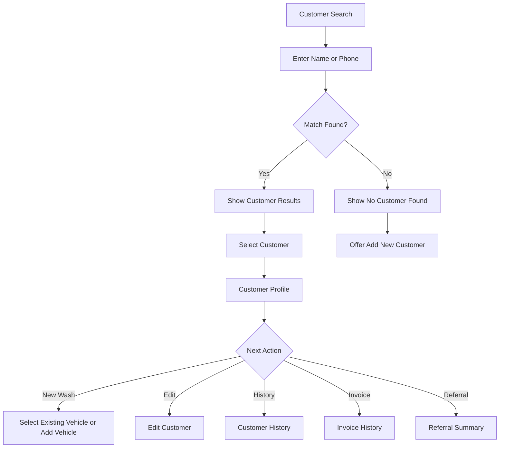

---

## 7.3 Duplicate Customer Warning

When Staff enters a phone number during customer registration:

```text
Phone number entered
  ↓
System checks existing active and inactive customer records
  ├── No match → Continue
  └── Match found → Show duplicate warning
                   Display matching customer
                   Offer:
                   1. Open existing customer
                   2. Continue only with authorized reason
                   3. Cancel
```

The default action should be to use the existing customer.

---

## 8. Add Customer Flow

## 8.1 Add Customer Screen

### Fields

- Full name
- Phone number
- Email address
- Address
- Notes
- Referral source, optional
- Customer status

### Actions

- Save and Add Vehicle
- Save Customer
- Cancel

---

## 8.2 Add Customer Validation

- Full name is required.
- Phone number is required.
- Phone number must follow the configured format.
- Email must be valid when provided.
- Duplicate phone number should trigger a warning.
- Leading and trailing spaces should be removed.
- Empty optional fields should not block saving.

---

## 8.3 Add Customer Success Flow

```text
Staff completes customer form
  ↓
System validates fields
  ↓
Customer record is created
  ↓
Customer ID is generated
  ↓
Referral code is generated if enabled
  ↓
Success message appears
  ↓
Staff chooses:
  1. Add Vehicle
  2. Start New Wash
  3. Open Customer Profile
  4. Return to Staff Home
```

---

## 9. Customer Profile Flow

The Customer Profile should contain the following tabs or sections:

1. Overview
2. Vehicles
3. Wash History
4. Invoices
5. Payments
6. Coupons
7. Referrals
8. Photos and Locations
9. Notes

---

## 9.1 Customer Overview

Show:

- Customer name
- Phone number
- Email
- Address
- Registration date
- Total visits
- Total amount spent
- Active referral code
- Available referral rewards
- Status
- Edit button
- New Wash button
- Add Vehicle button

---

## 9.2 Edit Customer Flow

```text
Open Customer Profile
  ↓
Tap Edit
  ↓
Modify permitted fields
  ↓
Validate duplicate phone number and email format
  ↓
Save
  ↓
Show updated profile
  ↓
Record audit entry if sensitive information changed
```

---

## 9.3 Deactivate Customer Flow

Only an authorized user can deactivate a customer.

```text
Select Deactivate
  ↓
Show impact warning
  ↓
Require reason
  ↓
Confirm
  ↓
Customer status becomes inactive
  ↓
Existing history remains available
  ↓
New wash creation is blocked until reactivated
```

---

## 10. Vehicle Search Flow

## 10.1 Vehicle Search Screen

Search by:

- Registration number
- Customer name
- Customer phone number
- Vehicle make
- Vehicle model

Each result should show:

- Registration number
- Vehicle type
- Make and model
- Colour
- Customer name
- Last wash date
- Status
- Open Vehicle button
- Start New Wash button

---

## 10.2 Registration Number Normalization

Before searching or saving:

- Convert letters to uppercase.
- Remove leading and trailing spaces.
- Collapse unnecessary internal spaces.
- Apply a consistent registration format.

Example:

```text
Input: kl 24 ab 1234
Stored: KL 24 AB 1234
```

---

## 11. Add Vehicle Flow

## 11.1 Add Vehicle Screen

### Fields

- Customer
- Registration number
- Vehicle type
- Make
- Model
- Manufacturing year
- Colour
- Fuel type, optional
- Front image, optional
- Rear image, optional
- Notes
- Active status

### Actions

- Save Vehicle
- Save and Start Wash
- Cancel

---

## 11.2 Duplicate Vehicle Flow

```text
Registration number entered
  ↓
System normalizes registration number
  ↓
System checks existing vehicles
  ├── No match → Continue
  └── Match found → Block duplicate save
                   Show current owner
                   Offer Open Existing Vehicle
```

A registration number should normally belong to only one active vehicle record.

---

## 11.3 Vehicle Success Flow

```text
Vehicle saved
  ↓
Vehicle linked to customer
  ↓
Success message shown
  ↓
Choose:
  1. Start New Wash
  2. Open Vehicle Details
  3. Add Another Vehicle
  4. Return to Customer Profile
```

---

## 12. Vehicle Details Flow

The Vehicle Details screen should show:

- Registration number
- Vehicle type
- Make and model
- Year
- Colour
- Owner
- Total washes
- Last wash
- Total amount spent
- Previous live photos
- Previous GPS locations
- Invoice history
- Notes
- Edit button
- New Wash button

---

## 13. New Wash Workflow

The New Wash workflow should use a clear step-by-step wizard.

Recommended steps:

1. Customer
2. Vehicle
3. Live Photo and GPS
4. Services
5. Discounts
6. Review
7. Create Job

A visible progress indicator should show the current step.

---

## 13.1 New Wash — Step 1: Select Customer

### Options

- Search existing customer
- Select recent customer
- Add new customer

### Flow

```text
Open New Wash
  ↓
Select or add customer
  ↓
System checks customer status
  ├── Active → Continue
  └── Inactive → Block and show reactivation requirement
```

---

## 13.2 New Wash — Step 2: Select Vehicle

### Options

- Select an existing vehicle belonging to the customer
- Add a new vehicle

### Validation

- Vehicle must belong to the selected customer.
- Vehicle must be active.
- Vehicle type must be configured.
- Registration number must be available.

---

## 13.3 New Wash — Step 3: Live Photo and GPS

This step is mandatory when configured by the Admin.

### Screen Components

- Customer summary
- Vehicle summary
- Camera permission status
- Location permission status
- Take Live Photo button
- GPS capture status
- GPS accuracy
- Business-location verification
- Retake button
- Retry GPS button
- Continue button

---

## 14. Camera Permission Flow

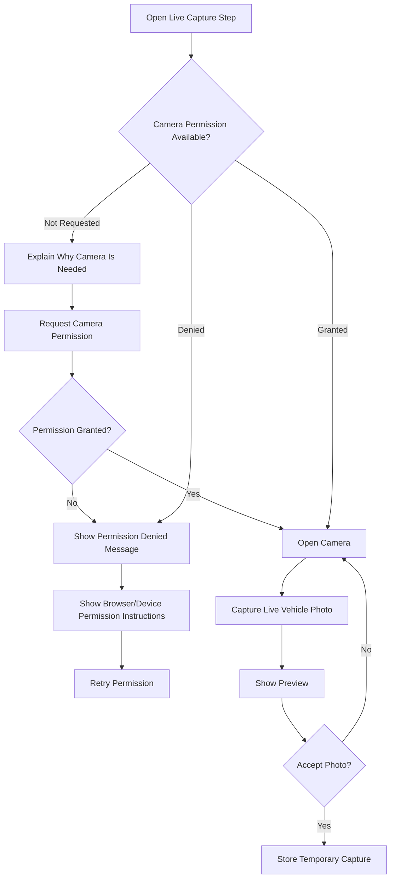

### Camera Rules

- Mandatory live-photo capture must use the camera.
- Gallery upload must not replace the required live capture.
- The captured image should be compressed before upload where appropriate.
- The original capture timestamp must be recorded.
- The Staff user and device session must be linked to the capture.

---

## 15. GPS Permission and Capture Flow

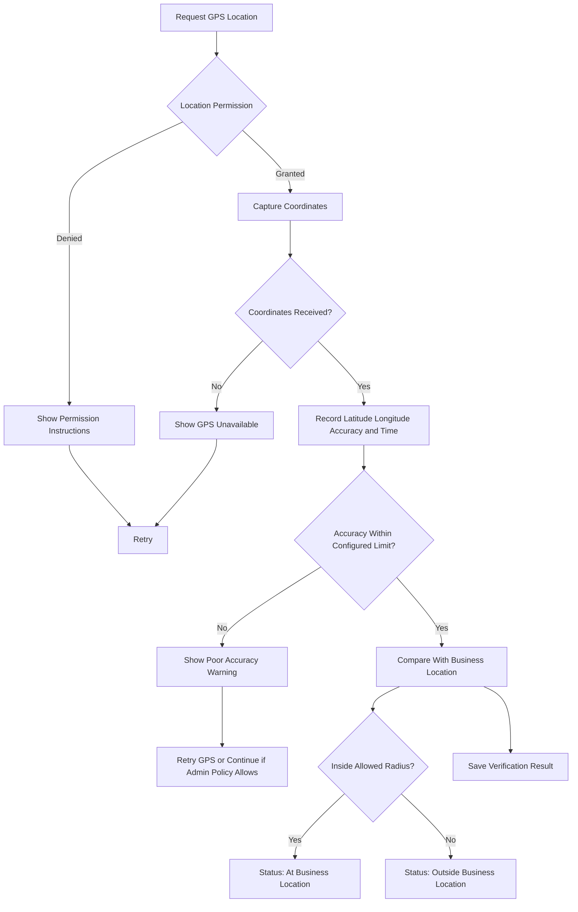

### GPS Rules

- Latitude, longitude, accuracy, and timestamp must be stored.
- The minimum acceptable accuracy should come from Business Settings.
- The allowed business radius should come from Location Settings.
- A failure reason should be stored when location capture fails.
- Staff should not be able to manually type GPS coordinates.
- Admin override should require a reason and create an audit log.

---

## 16. Photo and GPS Completion Rules

The user can continue only when:

- A valid customer is selected.
- A valid vehicle is selected.
- A live camera image is accepted.
- GPS coordinates are captured.
- GPS accuracy is recorded.
- Location verification status is calculated.

When mandatory capture cannot be completed:

```text
Capture requirement not satisfied
  ↓
Continue button remains disabled
  ↓
User sees exact missing requirement
  ↓
Retry options are shown
  ↓
Authorized Admin override may be offered when enabled
```

---

## 17. New Wash — Step 4: Service Selection

The Service Selection screen should show only active services applicable to the selected vehicle type.

## 17.1 Service Card Content

- Service name
- Description
- Vehicle-specific price
- Estimated duration
- Tax applicability
- Select button

## 17.2 Primary Service Rules

- At least one primary wash service must be selected.
- Only one primary service may be selected unless the business allows multiple packages.
- Disabled services must not be displayed.
- The current price must be copied into the job as a price snapshot.

## 17.3 Add-On Selection

Optional add-ons may be selected after the primary service.

Each add-on should show:

- Name
- Price
- Estimated duration
- Quantity, when relevant
- Selected state

---

## 18. Price Calculation Preview

As services are selected, the application should calculate:

```text
Primary service
+ Add-ons
= Subtotal
− Eligible discount
+ Tax or GST
± Configured rounding
= Final payable amount
```

The Staff user should see a live price summary.

---

## 19. New Wash — Step 5: Coupon and Referral Flow

The Staff user may choose:

- No discount
- Coupon code
- Referral code
- Referral reward redemption
- Manual discount, if permitted

Coupon and referral stacking must follow Admin settings.

---

## 20. Coupon Application Flow

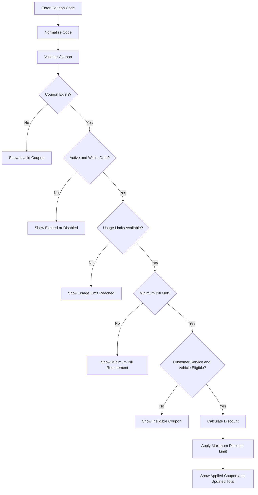

### Coupon Removal

The user can remove the coupon before job confirmation.

After completion, coupon removal or financial changes should require an audited adjustment.

---

## 21. Referral Code Application Flow

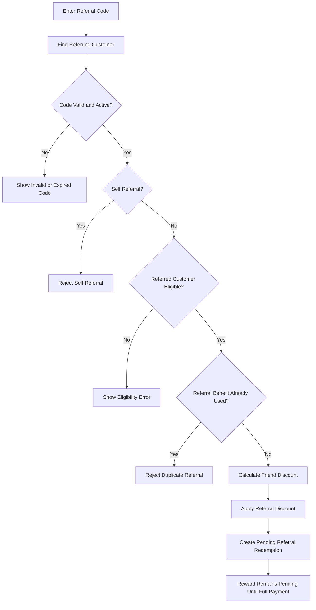

---

## 22. Referral Reward Redemption Flow

A customer with available rewards may redeem them on a future wash.

```text
Select Use Referral Reward
  ↓
System loads available unexpired rewards
  ↓
Staff selects reward amount or eligible reward
  ↓
System validates minimum bill and eligible services
  ↓
Reward is reserved for the current job
  ↓
Final bill is recalculated
  ↓
Reward becomes Used only after successful completion and payment
```

If the job is cancelled before payment, the reserved reward should return to Available status.

---

## 23. New Wash — Step 6: Review

The Review screen should show:

### Customer

- Name
- Phone number

### Vehicle

- Registration number
- Vehicle type
- Make and model

### Verification

- Live photo thumbnail
- Capture timestamp
- GPS coordinates
- GPS accuracy
- Location verification status

### Services

- Primary service
- Add-ons
- Estimated duration

### Billing

- Original subtotal
- Coupon or referral code
- Discount
- Tax
- Rounding
- Final amount

### Assignment

- Assigned Staff member
- Initial job status
- Notes

### Actions

- Back and Edit
- Create Job
- Cancel

---

## 24. New Wash — Step 7: Job Creation

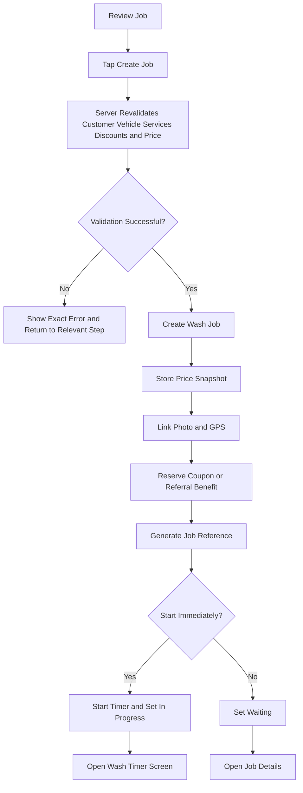

---

## 25. Wash Job Reference

Each job should receive a unique reference.

Example:

```text
WJ-2026-000001
```

The job reference should appear on:

- Active Jobs
- Job Details
- Payment screen
- Invoice
- Customer history
- Vehicle history
- Audit logs

---

## 26. Active Jobs Screen

## 26.1 Default Filters

- Waiting
- In Progress
- Paused

## 26.2 Optional Filters

- All
- Assigned to Me
- Assigned Staff
- Vehicle type
- Service
- Date
- Payment status

## 26.3 Job Card or Row

Show:

- Job reference
- Vehicle registration
- Customer
- Service
- Assigned Staff
- Status
- Start time
- Live timer
- Final amount
- Payment status
- Primary action

---

## 27. Wash Job Status Flow

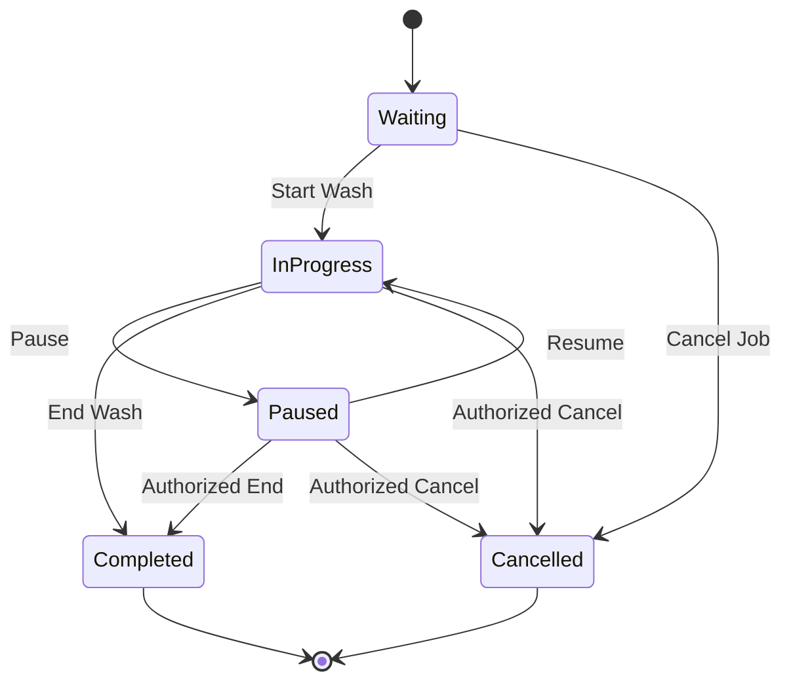

---

## 28. Waiting Job Flow

A Waiting job should allow:

- Start Wash
- Edit services, when permitted
- Change assigned Staff
- View photo and GPS
- Apply or remove discount before starting, when permitted
- Cancel job with reason

The timer must not run while the job is Waiting.

---

## 29. Start Wash Flow

```text
Open Waiting job
  ↓
Tap Start Wash
  ↓
System confirms:
- Photo exists
- GPS exists
- Service exists
- Job is not cancelled or completed
- No timer is already running
  ↓
Server stores start timestamp
  ↓
Timer event "Start" is created
  ↓
Job status becomes In Progress
  ↓
Live timer appears
```

---

## 30. Pause Wash Flow

```text
Tap Pause
  ↓
Optional pause reason is requested
  ↓
Server stores pause timestamp
  ↓
Timer event "Pause" is created
  ↓
Status becomes Paused
  ↓
Active duration stops increasing
```

Examples of pause reasons:

- Waiting for customer approval
- Equipment issue
- Power interruption
- Water interruption
- Staff break
- Other

---

## 31. Resume Wash Flow

```text
Open Paused job
  ↓
Tap Resume
  ↓
Server verifies no timer is already running
  ↓
Resume timestamp is stored
  ↓
Timer event "Resume" is created
  ↓
Status becomes In Progress
  ↓
Active duration continues
```

---

## 32. Timer Persistence Flow

The displayed timer should be calculated using server timestamps.

```text
Page refreshed or reopened
  ↓
Application fetches job timer events
  ↓
System calculates completed active intervals
  ↓
If currently running, add time since latest Start or Resume
  ↓
Display correct active duration
```

The browser must not be the final source of truth for timer duration.

---

## 33. End Wash Flow

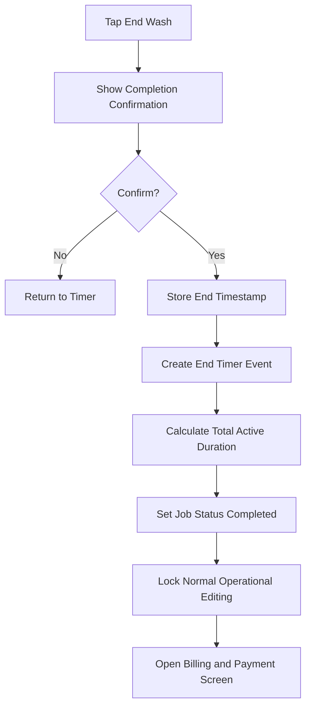

An optional completion photo can be supported in a future version.

---

## 34. Cancel Wash Flow

A job may be cancelled only when allowed by the current status and user permission.

### Required Fields

- Cancellation reason
- Additional notes, optional

### Flow

```text
Tap Cancel Job
  ↓
Show warning
  ↓
Require cancellation reason
  ↓
Check applied coupon, referral, or reward reservation
  ↓
Release reserved benefits where applicable
  ↓
Set status to Cancelled
  ↓
Record user and timestamp
  ↓
Write audit log
```

A cancelled job must not count as paid revenue.

---

## 35. Completed Job Locking

After completion:

- Service price snapshots must remain unchanged.
- Normal users must not directly edit timer events.
- Normal users must not delete the job.
- Invoice values must remain immutable.
- Payment actions may still be allowed.
- Corrections must use an authorized adjustment flow.
- Every correction must create an audit record.

---

## 36. Billing Review Flow

After the wash ends, show a final billing review.

### Display

- Service items
- Add-ons
- Original subtotal
- Coupon discount
- Referral discount or reward
- Tax
- Rounding
- Final payable amount
- Previous payments
- Remaining balance

### Actions

- Record Full Payment
- Record Partial Payment
- Mark Payment Pending
- Admin Adjustment
- Cancel

---

## 37. Payment Entry Flow

## 37.1 Payment Fields

- Amount
- Payment method
- Transaction reference
- Payment date and time
- Received by
- Notes

## 37.2 Payment Methods

- Cash
- UPI
- Card
- Bank transfer
- Other

---

## 37.3 Full Payment Flow

```text
Enter full payable amount
  ↓
Select payment method
  ↓
Enter transaction reference when required
  ↓
Submit
  ↓
System verifies total paid equals payable amount
  ↓
Payment status becomes Paid
  ↓
Coupon redemption becomes final
  ↓
Referral redemption becomes successful
  ↓
Referrer reward is created
  ↓
Invoice generation becomes available
```

---

## 37.4 Partial Payment Flow

```text
Enter amount lower than remaining balance
  ↓
System records payment
  ↓
Payment status becomes Partially Paid
  ↓
Remaining balance is displayed
  ↓
Referral reward remains pending
  ↓
Invoice may show partial payment based on business settings
```

---

## 37.5 Pending Payment Flow

```text
Choose Payment Pending
  ↓
Require reason or note when configured
  ↓
Job remains Completed
  ↓
Payment status becomes Pending
  ↓
Job appears in Pending Payments list
  ↓
Referral reward is not issued
```

---

## 38. Additional Payment Flow

For a partially paid job:

```text
Open Pending Payments
  ↓
Select job
  ↓
Review previous payments and remaining balance
  ↓
Add payment
  ↓
Recalculate total paid
  ├── Remaining balance > 0 → Partially Paid
  └── Remaining balance = 0 → Paid
                               Finalize referral reward
```

---

## 39. Refund Flow

Refunds require Admin permission.

```text
Open Paid Job or Payment
  ↓
Select Refund
  ↓
Enter refund amount
  ↓
Enter reason
  ↓
Confirm
  ↓
Create refund transaction
  ↓
Update payment status
  ↓
Reverse or adjust referral reward when required
  ↓
Update revenue reports
  ↓
Write audit log
```

The original payment record must remain available.

---

## 40. Invoice Generation Flow

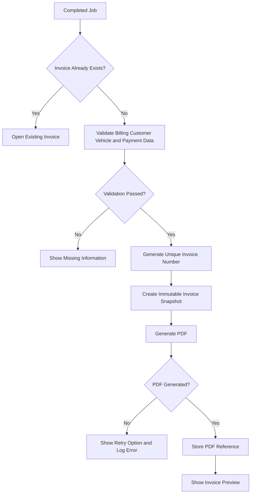

---

## 41. Invoice Preview Screen

The preview should show:

- Business logo and details
- Invoice number
- Date and time
- Customer details
- Vehicle details
- Service and add-ons
- Start and completion times
- Active duration
- Original amount
- Discount code
- Discount amount
- Tax
- Final amount
- Payment method
- Payment status
- Staff member
- Customer referral code
- Thank-you message
- Terms and footer

### Actions

- Download PDF
- Print
- Share through WhatsApp
- Return to Job
- Open Customer Profile
- Open Vehicle Profile

---

## 42. Invoice Number Flow

Invoice numbers must be unique and generated on the server.

Example:

```text
WP-2026-000001
```

If invoice generation is retried, the system should not create duplicate invoice numbers for the same job.

---

## 43. WhatsApp Sharing Flow

```text
Open Invoice Preview
  ↓
Tap Share through WhatsApp
  ↓
System creates pre-filled message containing:
- Customer name
- Vehicle number
- Service
- Amount
- Payment status
- Invoice number
- Referral code
- Invoice link, when available
  ↓
System opens WhatsApp or WhatsApp Web
  ↓
Staff reviews message
  ↓
Staff sends message manually
```

The first release should not claim that the PDF is automatically attached through a standard `wa.me` link.

---

## 44. WhatsApp Fallback Flow

When WhatsApp cannot open:

- Show Copy Message button.
- Show Copy Invoice Link button.
- Show Download PDF button.
- Allow Staff to share manually.
- Show a simple explanation.

---

## 45. Customer History Update Flow

After a valid wash job is completed:

- Increment total visits.
- Update total amount spent using valid paid amounts.
- Add wash history entry.
- Add invoice history entry.
- Add payment history entry.
- Link vehicle photo and GPS capture.
- Update last visit date.
- Update referral status.
- Update available rewards where applicable.

---

## 46. Vehicle History Update Flow

After completion:

- Add wash date.
- Add service and add-ons.
- Add total active duration.
- Link before-wash photo.
- Link GPS data.
- Link Staff user.
- Link payment status.
- Link invoice.
- Update last wash date.
- Update total wash count.

---

## 47. Referral Reward Completion Flow

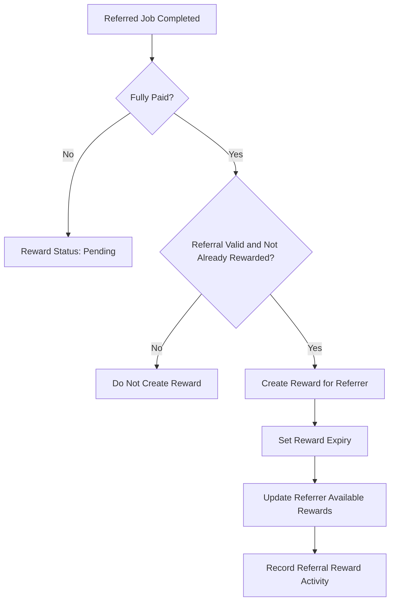

---

## 48. Staff Wash History Flow

The Wash History screen should support:

- Date filter
- Status filter
- Customer search
- Vehicle search
- Service filter
- Payment status filter
- Staff filter, where permitted

Each job should open a Job Details page.

---

## 49. Job Details Screen

The Job Details screen should include:

1. Job Overview
2. Customer
3. Vehicle
4. Photo
5. GPS
6. Services
7. Discounts
8. Timer Events
9. Payments
10. Invoice
11. Notes
12. Audit History, Admin only

---

## 50. Admin Dashboard Flow

After Admin login, the dashboard loads the selected period, normally Today.

## 50.1 Dashboard Cards

- Today’s revenue
- Today’s expenses
- Today’s net profit
- Cars washed today
- Vehicles waiting
- Jobs in progress
- Paused jobs
- Completed jobs
- Pending payments
- Available referral rewards

## 50.2 Dashboard Charts

- Revenue by service
- Revenue by vehicle type
- Daily revenue trend
- Monthly revenue trend
- Expense breakdown
- Profit trend
- Coupon usage
- Referral performance
- Staff job count
- Average wash duration

## 50.3 Dashboard Actions

- Open active jobs
- Add expense
- Create Staff user
- Add service
- Create coupon
- View reports
- Open pending payments
- Open recent activity

---

## 51. Dashboard Date Filter Flow

```text
Admin selects Today / Week / Month / Custom
  ↓
System validates date range
  ↓
Dashboard fetches matching data
  ↓
Cards and charts refresh together
  ↓
Selected date range remains visible
```

---

## 52. Staff Management Flow

## 52.1 Staff List

Show:

- Full name
- Username
- Phone
- Email
- Role
- Status
- Last login
- Date created
- Actions

### Actions

- Add Staff
- Edit
- Reset Password
- Disable
- Enable
- View Activity

---

## 52.2 Add Staff Flow

```text
Admin opens Staff Management
  ↓
Tap Add Staff
  ↓
Enter account details
  ↓
Select role and permissions
  ↓
Set temporary password
  ↓
Validate unique username, phone, and email
  ↓
Create account
  ↓
Optionally require password change on first login
  ↓
Record audit log
```

---

## 52.3 Disable Staff Flow

```text
Admin selects Disable
  ↓
Show warning
  ↓
Require confirmation
  ↓
Set account status Disabled
  ↓
Terminate active sessions where supported
  ↓
Prevent future login
  ↓
Preserve activity history
  ↓
Write audit log
```

---

## 52.4 Reset Staff Password Flow

```text
Admin selects Reset Password
  ↓
Generate or enter temporary password
  ↓
Confirm reset
  ↓
Invalidate old password
  ↓
Optionally terminate sessions
  ↓
Require password change on next login
  ↓
Write audit log
```

---

## 53. Service Management Flow

## 53.1 Service List

Show:

- Service name
- Category
- Base price
- Vehicle-type pricing status
- Estimated duration
- Tax applicable
- Active status
- Display order
- Usage count

### Actions

- Add Service
- Edit
- Manage Prices
- Enable
- Disable
- View Usage

---

## 53.2 Add Service Flow

```text
Admin taps Add Service
  ↓
Enter service details
  ↓
Choose service or add-on type
  ↓
Set base price
  ↓
Set estimated duration
  ↓
Set tax applicability
  ↓
Assign vehicle-specific prices
  ↓
Set active status
  ↓
Save
```

---

## 53.3 Edit Price Flow

```text
Open Service
  ↓
Select Vehicle-Type Pricing
  ↓
Edit one or more prices
  ↓
Show old and new values
  ↓
Save
  ↓
New jobs use new price
  ↓
Existing and completed jobs keep price snapshots
  ↓
Write audit log
```

---

## 53.4 Disable Service Flow

Disabled services:

- Must not appear for new jobs.
- Must remain visible in historical jobs.
- Must retain old invoice data.
- May be re-enabled later.

---

## 54. Coupon Management Flow

## 54.1 Coupon List

Show:

- Code
- Discount type
- Discount value
- Start and expiry date
- Usage count
- Usage limit
- Active status
- Total discount provided

### Actions

- Create
- Edit
- Enable
- Disable
- Delete unused coupon
- View usage

---

## 54.2 Create Coupon Flow

```text
Admin opens Coupon Management
  ↓
Tap Create Coupon
  ↓
Enter unique code
  ↓
Choose fixed or percentage discount
  ↓
Set value and maximum discount
  ↓
Set minimum bill
  ↓
Set date range
  ↓
Set total and per-customer limits
  ↓
Select eligible services and vehicle types
  ↓
Set customer restrictions
  ↓
Activate coupon
  ↓
Save
```

---

## 54.3 Coupon Edit Rules

- Used coupon history must remain unchanged.
- Editing a coupon affects future validation only.
- Used coupons should not normally be deleted.
- Disabling a coupon prevents new redemptions.
- Every significant change should be audited.

---

## 55. Referral Management Flow

## 55.1 Referral Dashboard

Show:

- Active referral programme status
- Total referral codes
- Successful referrals
- Pending rewards
- Available rewards
- Used rewards
- Expired rewards
- Total referral discounts
- Total referral rewards

---

## 55.2 Referral Settings Flow

Admin configures:

- Programme enabled or disabled
- Friend discount
- Referrer reward
- Fixed or percentage type
- Minimum bill
- Maximum discount
- Code expiry
- Reward expiry
- Eligible services
- Eligible vehicle types
- New-customer-only rule
- Maximum successful referrals
- Coupon stacking
- Reward redemption rules

Changes should affect future referral activity without corrupting historical records.

---

## 55.3 Manual Referral Adjustment

Only Admin can perform manual adjustments.

```text
Open Customer Referral Summary
  ↓
Select Add / Remove / Correct Reward
  ↓
Enter amount or reward record
  ↓
Require detailed reason
  ↓
Show confirmation
  ↓
Apply adjustment transaction
  ↓
Prevent balance below zero
  ↓
Write audit log
```

---

## 56. Expense Management Flow

## 56.1 Expense List

Filters:

- Date
- Category
- Payment method
- Recorded by
- Amount range

Each expense should show:

- Title
- Category
- Amount
- Date
- Payment method
- Recorded by
- Receipt status
- Actions

---

## 56.2 Add Expense Flow

```text
Admin opens Expenses
  ↓
Tap Add Expense
  ↓
Enter title, category, amount, date, payment method, and description
  ↓
Optionally attach receipt
  ↓
Validate amount and file
  ↓
Save expense
  ↓
Update expense reports
  ↓
Update net profit
```

---

## 56.3 Edit Expense Flow

```text
Open expense
  ↓
Tap Edit
  ↓
Modify permitted fields
  ↓
Show original and updated amount if changed
  ↓
Require reason for important financial changes
  ↓
Save
  ↓
Recalculate reports
  ↓
Write audit log
```

---

## 56.4 Delete or Cancel Expense Flow

Financial records should normally be cancelled or soft-deleted rather than permanently erased.

```text
Select Cancel Expense
  ↓
Require reason
  ↓
Confirm
  ↓
Mark expense cancelled
  ↓
Exclude from active expense totals
  ↓
Preserve original record
  ↓
Write audit log
```

---

## 57. Reports Flow

## 57.1 Reports Home

Available reports:

- Daily revenue
- Weekly revenue
- Monthly revenue
- Custom revenue
- Expenses
- Net profit
- Wash count
- Service popularity
- Vehicle-type distribution
- Customer visit frequency
- Coupon usage
- Referral usage
- Staff performance
- Pending payments
- Completed and cancelled jobs
- Average wash duration

---

## 57.2 Report Generation Flow

```text
Admin selects report
  ↓
Select date range
  ↓
Apply optional filters
  ↓
Tap Generate
  ↓
System validates filters
  ↓
System loads report
  ↓
Display summary cards, table, and chart
  ↓
Offer PDF and Excel/CSV export
```

---

## 57.3 Report Export Flow

```text
Open generated report
  ↓
Tap Export
  ↓
Select PDF or Excel/CSV
  ↓
System generates file using current filters
  ↓
Download begins
  ↓
Export action may be recorded
```

The export must match the visible report date range and filters.

---

## 58. Revenue and Profit Calculation Flow

```text
Paid wash jobs
  ↓
Subtract valid refunds and excluded cancellations
  ↓
Calculate total revenue
  ↓
Load active non-cancelled expenses
  ↓
Calculate total expenses
  ↓
Net Profit = Total Revenue − Total Expenses
```

Accounting rules for partial payments, refunds, and pending payments must be consistent across dashboard and reports.

---

## 59. Invoice History Flow

The Invoice History screen should allow search by:

- Invoice number
- Customer
- Phone number
- Vehicle registration
- Job reference
- Date range
- Payment status
- Staff member

Actions:

- View
- Download
- Print
- Re-share
- Open related job
- Open customer
- Open vehicle

---

## 60. Payment History Flow

Filters:

- Date
- Payment method
- Payment status
- Customer
- Vehicle
- Job
- Received by

Actions:

- View payment
- Add payment to partial balance
- Refund, Admin only
- Open invoice
- Open job
- Export

---

## 61. Business Settings Flow

Business Settings sections:

1. Business Profile
2. Invoice Settings
3. Tax Settings
4. Payment Settings
5. Referral Settings
6. Coupon Rules
7. Location Settings
8. Date, Time, Currency, and Number Formats
9. Data Retention
10. Security Settings

---

## 61.1 Business Profile Settings

Fields:

- Business name
- Logo
- Address
- Phone
- WhatsApp number
- Email
- Tax or GST number
- Working hours

---

## 61.2 Invoice Settings

Fields:

- Invoice prefix
- Starting sequence
- Invoice footer
- Thank-you message
- Terms
- Logo visibility
- Tax visibility
- Referral message

Invoice numbering changes must not modify old invoice numbers.

---

## 61.3 Location Settings Flow

```text
Admin opens Location Settings
  ↓
Use current location or enter approved business coordinates
  ↓
Set allowed radius
  ↓
Set minimum GPS accuracy
  ↓
Preview location on map, when available
  ↓
Save
  ↓
Future capture verification uses new settings
  ↓
Write audit log
```

---

## 61.4 Settings Save Flow

```text
Admin edits setting
  ↓
Client-side validation
  ↓
Submit
  ↓
Server-side validation
  ↓
Save
  ↓
Refresh affected components
  ↓
Show success message
  ↓
Write audit log for sensitive settings
```

---

## 62. Audit Log Flow

## 62.1 Audit Log List

Filters:

- User
- Action
- Record type
- Record ID
- Date range
- IP or device
- Severity

Each record should show:

- User
- Action
- Record
- Previous value summary
- New value summary
- Timestamp
- Device or IP
- View Details

---

## 62.2 Audit Detail Flow

```text
Admin opens audit record
  ↓
View:
- User
- Action
- Date and time
- Record type and ID
- Previous values
- New values
- Reason
- IP/device information
  ↓
Return to Audit Log
```

Audit logs should be read-only.

---

## 63. Notifications and Feedback

The application should use:

- Success messages for completed actions.
- Warning messages for recoverable risks.
- Error messages for failed actions.
- Confirmation dialogs for destructive or financial actions.
- Loading indicators for network operations.
- Empty-state messages when no data exists.
- Retry actions where possible.

---

## 64. Form Behaviour

All forms should:

- Clearly mark required fields.
- Validate fields before submission.
- Show errors next to the relevant field.
- Preserve entered data after correctable errors.
- Disable the submit button while saving.
- Prevent duplicate submission.
- Warn before leaving with unsaved changes.
- Use large inputs on mobile.

---

## 65. Unsaved Changes Flow

```text
User edits form
  ↓
User tries to leave
  ↓
System detects unsaved changes
  ↓
Show:
"Discard unsaved changes?"
  ├── Stay → Return to form
  └── Discard → Leave page
```

---

## 66. Loading State Flow

When data is loading:

- Show skeleton cards or a progress indicator.
- Keep navigation responsive.
- Avoid showing incorrect zero totals.
- Disable repeated action buttons.
- Replace loading state with data, empty state, or error state.

---

## 67. Empty State Flow

Examples:

### No Customers

Show:

- “No customers found.”
- Add Customer button
- Clear Filters button

### No Active Jobs

Show:

- “No active wash jobs.”
- New Wash button

### No Invoices

Show:

- “No invoices are available for the selected filters.”
- Clear Filters button

---

## 68. Network Interruption Flow

```text
User submits action
  ↓
Network failure occurs
  ↓
System determines whether server accepted the action
  ├── Confirmed not saved → Show Retry
  ├── Unknown status → Refresh and verify before resubmitting
  └── Saved → Load updated record
```

The application must avoid duplicate jobs, payments, invoices, coupon redemptions, and referral rewards after retries.

---

## 69. File Upload Flow

Used for:

- Vehicle images
- Business logo
- Expense receipts
- Generated invoices

### Flow

```text
Select or capture file
  ↓
Validate type and size
  ↓
Compress image when suitable
  ↓
Upload securely
  ↓
Show progress
  ↓
Store file reference
  ↓
Link file to record
```

### Failure Behaviour

- Keep the form open.
- Explain the upload error.
- Allow retry.
- Do not create an incomplete record silently.
- Remove abandoned temporary files where possible.

---

## 70. Permission Enforcement Flow

Every protected action must be checked twice:

1. Frontend visibility check
2. Backend authorization check

```text
User attempts action
  ↓
Frontend checks role
  ↓
API request is sent
  ↓
Backend checks authenticated user and permission
  ├── Allowed → Perform action
  └── Denied → Return access-denied response
```

Hiding a button alone is not sufficient security.

---

## 71. Access Denied Flow

```text
Unauthorized page or action requested
  ↓
System blocks access
  ↓
Show: "You do not have permission to access this feature."
  ↓
Offer Return to Dashboard or Home
  ↓
Record suspicious access when appropriate
```

---

## 72. Staff Permission Summary

Staff can normally:

- Register customers
- Edit permitted customer details
- Add vehicles
- Search customers and vehicles
- Create wash jobs
- Capture live photo and GPS
- Select services and add-ons
- Apply valid discounts
- Control assigned wash timers
- Record payments
- Generate and share invoices
- View permitted operational history

Staff cannot normally:

- View net profit
- Manage global services and prices
- Manage Staff accounts
- Change business settings
- Change referral programme settings
- Edit completed financial records
- View audit logs
- Perform refunds
- Correct timer history

---

## 73. Admin Permission Summary

Admin can access all operational and management flows, including:

- Staff management
- Pricing
- Coupons
- Referrals
- Expenses
- Revenue
- Profit
- Reports
- Settings
- Refunds
- Audited corrections
- Audit logs

---

## 74. Mobile Staff Journey

A recommended fast mobile flow:

```text
Staff Home
  ↓
Tap New Wash
  ↓
Search phone number
  ↓
Select customer
  ↓
Select vehicle
  ↓
Take photo
  ↓
Capture GPS
  ↓
Select service
  ↓
Review price
  ↓
Create and Start
  ↓
Timer screen
  ↓
End Wash
  ↓
Record payment
  ↓
Generate invoice
  ↓
Share WhatsApp message
```

The primary Staff journey should require as few screens and taps as practical.

---

## 75. Desktop Admin Journey

A recommended Admin workflow:

```text
Admin Dashboard
  ↓
Review revenue, jobs, expenses, and alerts
  ↓
Open Active Jobs or Reports
  ↓
Manage Staff, Services, Coupons, or Expenses
  ↓
Review payment and invoice history
  ↓
Check audit activity
  ↓
Update settings when required
```

---

## 76. Search and Filter Behaviour

All list pages should support:

- Search input
- Relevant filters
- Clear Filters action
- Sort options
- Pagination or efficient infinite loading
- Result count
- Mobile filter drawer
- Retained filters when returning from detail view, where possible

---

## 77. Confirmation Dialogs

Confirmation is required for:

- Logout with unsaved changes
- Disable Staff
- Deactivate Customer
- Cancel Wash Job
- End Wash
- Delete unused Coupon
- Cancel Expense
- Refund Payment
- Correct Timer
- Change financial values
- Change sensitive settings

Each confirmation should explain the effect of the action.

---

## 78. Error Message Examples

### Login

- “The username or password is incorrect.”
- “This account is disabled. Contact the administrator.”

### Customer

- “A customer with this phone number already exists.”

### Vehicle

- “This vehicle registration number is already registered.”

### Camera

- “Camera access is required to capture the live vehicle photo.”

### GPS

- “Location access is required to verify where the photo was captured.”
- “GPS accuracy is too low. Move to an open area and try again.”

### Coupon

- “This coupon has expired.”
- “The minimum bill amount for this coupon has not been reached.”

### Referral

- “A customer cannot use their own referral code.”
- “This referral benefit has already been used.”

### Timer

- “The wash timer is already running.”
- “This completed job cannot be restarted.”

### Payment

- “The payment amount cannot exceed the remaining balance.”

### Invoice

- “The invoice could not be generated. Please try again.”

---

## 79. Data Consistency Rules

The system must ensure:

- One unique invoice number per invoice.
- One unique job reference per job.
- One unique active registration number per vehicle.
- One referral reward per successful referred job.
- Coupon usage limits are updated transactionally.
- Payment totals cannot exceed permitted values without refund logic.
- Final payable amount cannot be negative.
- Old job prices do not change after service price updates.
- Timer events remain ordered and auditable.
- Completed invoice snapshots remain immutable.

---

## 80. Transaction-Safe Flows

The following actions should use database transactions:

- Create wash job with selected services and discounts
- Coupon redemption
- Referral redemption
- Referral reward creation
- Payment recording
- Refund processing
- Invoice creation
- Expense financial correction
- Completed job adjustment

If any required step fails, the complete transaction should roll back safely.

---

## 81. Privacy Notice Flow

Before first use of camera and location capture, the Staff user should see a clear notice explaining:

- Why vehicle photographs are captured
- Why location is captured
- How information is used
- Who can access it
- That permissions are required

The notice may also appear in staff training and business privacy documentation.

---

## 82. Data Retention Flow

When the Admin configures retention rules:

```text
Admin selects retention period
  ↓
System explains affected data
  ↓
Admin confirms
  ↓
Policy is saved
  ↓
Eligible data is archived or removed according to policy
  ↓
Financial and audit retention rules remain protected
```

Deletion must respect legal and business requirements.

---

## 83. Responsive Behaviour

## 83.1 Mobile

- Single-column forms
- Bottom actions
- Card-based lists
- Camera-first capture flow
- Large controls
- Collapsible details
- Filter drawer

## 83.2 Tablet

- Two-column forms where appropriate
- Sidebar or compact navigation
- Split job summary and actions

## 83.3 Desktop

- Full sidebar
- Tables
- Multi-column dashboards
- Persistent filters
- Larger charts and reports

---

## 84. Suggested Route Map

The exact route names may change during implementation.

```text
/login

/staff
/staff/home
/staff/new-wash
/staff/jobs
/staff/jobs/:jobId
/staff/customers
/staff/customers/new
/staff/customers/:customerId
/staff/vehicles
/staff/vehicles/new
/staff/vehicles/:vehicleId
/staff/invoices
/staff/invoices/:invoiceId
/staff/history
/staff/profile

/admin
/admin/dashboard
/admin/jobs
/admin/jobs/:jobId
/admin/customers
/admin/customers/:customerId
/admin/vehicles
/admin/vehicles/:vehicleId
/admin/staff
/admin/staff/new
/admin/staff/:userId
/admin/services
/admin/services/new
/admin/services/:serviceId
/admin/pricing
/admin/coupons
/admin/coupons/new
/admin/coupons/:couponId
/admin/referrals
/admin/referrals/settings
/admin/expenses
/admin/expenses/new
/admin/expenses/:expenseId
/admin/payments
/admin/invoices
/admin/reports
/admin/settings
/admin/settings/business
/admin/settings/invoice
/admin/settings/location
/admin/settings/security
/admin/audit
/admin/profile
```

---

## 85. Screen Hierarchy

```text
Login
├── Admin Dashboard
│   ├── Active Jobs
│   │   └── Job Details
│   ├── Customers
│   │   └── Customer Profile
│   ├── Vehicles
│   │   └── Vehicle Details
│   ├── Staff Management
│   ├── Services and Pricing
│   ├── Coupons
│   ├── Referrals
│   ├── Expenses
│   ├── Payments
│   ├── Invoices
│   ├── Reports
│   ├── Settings
│   └── Audit Logs
│
└── Staff Home
    ├── New Wash
    │   ├── Customer
    │   ├── Vehicle
    │   ├── Live Photo and GPS
    │   ├── Services
    │   ├── Discounts
    │   ├── Review
    │   └── Job Created
    ├── Active Jobs
    │   └── Timer
    ├── Customers
    │   └── Customer Profile
    ├── Vehicles
    │   └── Vehicle Details
    ├── Payments
    ├── Invoice Preview
    └── Wash History
```

---

## 86. Major End-to-End User Journey 1 — New Customer

```text
Staff Login
  ↓
New Wash
  ↓
No existing customer found
  ↓
Add Customer
  ↓
Add Vehicle
  ↓
Capture Live Photo and GPS
  ↓
Select Service
  ↓
Apply Coupon if available
  ↓
Create Job
  ↓
Start Wash
  ↓
Pause and Resume if needed
  ↓
End Wash
  ↓
Record Payment
  ↓
Generate Invoice
  ↓
Share through WhatsApp
  ↓
Customer receives referral code
```

---

## 87. Major End-to-End User Journey 2 — Returning Customer

```text
Staff Login
  ↓
Search Customer by Phone
  ↓
Open Customer
  ↓
Select Existing Vehicle
  ↓
Start New Wash
  ↓
Capture New Live Photo and GPS
  ↓
Select Service
  ↓
Apply Available Referral Reward
  ↓
Create and Complete Job
  ↓
Record Payment
  ↓
Generate and Re-share Invoice
  ↓
Customer history updates
```

---

## 88. Major End-to-End User Journey 3 — Referred Customer

```text
New Customer Arrives
  ↓
Staff Registers Customer
  ↓
Staff Adds Vehicle
  ↓
Staff Enters Referrer Code
  ↓
System validates code
  ↓
Referred-customer discount is applied
  ↓
Wash is completed
  ↓
Full payment is recorded
  ↓
Referral redemption becomes successful
  ↓
Reward is issued to referrer
  ↓
Both histories are updated
```

---

## 89. Major End-to-End User Journey 4 — Partial Payment

```text
Wash Completed
  ↓
Bill Total Confirmed
  ↓
Customer Pays Part of Amount
  ↓
Staff Records Partial Payment
  ↓
Invoice shows remaining balance
  ↓
Job appears in Pending Payments
  ↓
Customer later pays balance
  ↓
Staff records final payment
  ↓
Payment status becomes Paid
  ↓
Referral reward is finalized
```

---

## 90. Major End-to-End User Journey 5 — Admin Daily Review

```text
Admin Login
  ↓
Dashboard
  ↓
Review revenue, expenses, profit, and active jobs
  ↓
Check pending payments
  ↓
Review recent cancellations
  ↓
Add daily expenses
  ↓
Open daily report
  ↓
Export report if required
  ↓
Review audit activity
```

---

## 91. Failure Journey — Camera Permission Denied

```text
Staff reaches Live Capture
  ↓
Camera permission is denied
  ↓
Application explains requirement
  ↓
Instructions to enable permission are shown
  ↓
Staff retries
  ├── Permission granted → Continue
  └── Still denied → Job cannot continue unless authorized override exists
```

---

## 92. Failure Journey — GPS Outside Business Location

```text
GPS captured
  ↓
Coordinates are outside allowed radius
  ↓
Show warning and distance
  ↓
Staff can retry
  ↓
If still outside:
  ├── Block according to policy
  └── Admin override with reason, if enabled
```

---

## 93. Failure Journey — Invalid Coupon

```text
Coupon entered
  ↓
Validation fails
  ↓
Show exact reason
  ↓
Do not modify total
  ↓
Allow correction, removal, or another code
```

---

## 94. Failure Journey — Invoice Generation Error

```text
Payment recorded
  ↓
Invoice generation fails
  ↓
Job and payment remain saved
  ↓
Show retry action
  ↓
Log technical error
  ↓
Retry uses same job and avoids duplicate invoice
```

---

## 95. Failure Journey — Duplicate Payment Submission

```text
Staff taps Save Payment
  ↓
Button becomes disabled
  ↓
Network response is delayed
  ↓
Staff refreshes or retries
  ↓
System checks transaction idempotency
  ↓
Existing payment is returned instead of creating duplicate
```

---

## 96. Acceptance Flow Checklist

The application flow is complete when:

- Admin and Staff are routed to correct home screens.
- Staff can find or create a customer.
- Staff can select or create a vehicle.
- Duplicate customers and vehicles are handled safely.
- Live photo and GPS capture are mandatory when configured.
- Camera and location permission failures have retry paths.
- Services and prices are selected according to vehicle type.
- Coupon and referral validation happens before job confirmation.
- Job creation stores price, photo, GPS, and discount snapshots.
- Timer state survives page refresh.
- Status transitions follow the defined state flow.
- Completed jobs are locked.
- Payments support pending, partial, paid, refund, and cancelled states.
- Referral rewards are created only after full eligible payment.
- Invoice creation is unique and retry-safe.
- WhatsApp sharing uses a pre-filled message and link/manual PDF flow.
- Customer and vehicle histories update correctly.
- Dashboard and reports use consistent financial rules.
- Admin-only pages are protected.
- Sensitive changes create audit logs.
- Mobile and desktop flows remain usable.

---

## 97. Recommended Implementation Priority

### Phase 1 — Foundation Flow

- Login
- Role routing
- Staff Home
- Admin Dashboard shell
- Customer flow
- Vehicle flow
- Permissions

### Phase 2 — Wash Operations Flow

- New Wash wizard
- Camera capture
- GPS capture
- Service selection
- Job creation
- Active Jobs
- Timer and status flow

### Phase 3 — Billing Flow

- Billing calculation
- Coupons
- Referrals
- Payments
- Invoice
- WhatsApp sharing

### Phase 4 — Business Management Flow

- Expenses
- Reports
- Dashboard data
- Customer and vehicle history
- Staff management
- Settings
- Audit logs

### Phase 5 — Quality Flow

- Error states
- Permission failures
- Retry and idempotency
- Mobile optimization
- Security testing
- Device testing
- Deployment and training

---

## 98. Final Application Flow Summary

WashPro should guide the Staff user through one clear operational process:

1. Log in.
2. Find or register the customer.
3. Select or add the vehicle.
4. Capture a live vehicle photo.
5. Capture and verify GPS location.
6. Select the wash service and add-ons.
7. Apply an eligible coupon, referral code, or reward.
8. Review the calculated amount.
9. Create the wash job.
10. Start and manage the wash timer.
11. Complete the wash.
12. Record full, partial, or pending payment.
13. Generate a professional invoice.
14. Download, print, or share the invoice.
15. Update customer, vehicle, payment, referral, revenue, expense, and reporting records.

The Admin flow should provide complete operational and financial control without interfering with the speed and simplicity required by Staff at the wash bay.

This application flow should be used as the reference for UI design, route planning, backend API design, database transactions, frontend state management, testing, and client approval.
