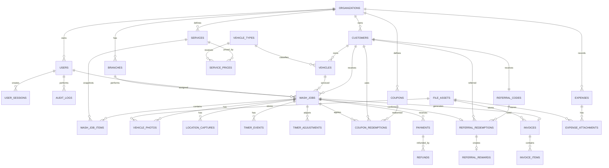

# WashPro — Database Design Specification

**Project Name:** WashPro  
**Document Type:** `database.md`  
**Version:** 1.0  
**Status:** Proposed  
**Primary Database:** Cloudflare D1  
**Database Model:** Relational SQL using SQLite semantics  
**File Storage:** Cloudflare R2  
**Cache / Short-Lived State:** Cloudflare KV where appropriate  
**Prepared For:** Car Wash Business Client  

---

## 1. Purpose

This document defines the complete database design for the WashPro Car Wash Management Web Application.

It translates the project requirements and application flow into:

- Database architecture
- Entity relationships
- Table definitions
- Field types
- Primary and foreign keys
- Unique constraints
- Check constraints
- Indexes
- Financial data rules
- Wash-job state rules
- Timer-event storage
- Coupon and referral transactions
- Payment and refund handling
- Immutable invoice snapshots
- Photo and GPS metadata
- Audit logging
- Soft deletion and retention
- Migration and backup procedures
- Performance and scalability guidance
- Suggested SQL schema

This document should be treated as the primary reference when creating:

- D1 migration files
- ORM or query-layer models
- Repository classes
- API request and response schemas
- Seed data
- Automated database tests
- Backup and recovery procedures

---

## 2. Database Objectives

The database must:

1. Store Admin and Staff accounts securely.
2. Store customers and multiple vehicles per customer.
3. Prevent accidental duplicate customers and vehicles.
4. Store configurable vehicle types, wash services, add-ons, and prices.
5. Preserve historical service and price snapshots.
6. Link every wash job to the correct customer, vehicle, Staff user, photo, and GPS capture.
7. Store reliable start, pause, resume, and end timer events.
8. Enforce valid wash-job status transitions at the application layer.
9. Store billing calculations in integer minor currency units.
10. Validate and record coupon usage.
11. Validate referral codes and issue rewards safely.
12. Store partial, full, refunded, and cancelled payment records.
13. Generate unique invoice and job reference numbers.
14. Preserve immutable invoice snapshots.
15. Store expense records and attachments.
16. support accurate revenue, expense, and net-profit reporting.
17. Record sensitive changes in append-only audit logs.
18. Support safe retries without creating duplicate jobs, payments, or invoices.
19. Remain efficient as business history grows.
20. Allow future multi-branch support without redesigning the complete schema.

---

## 3. Selected Database Architecture

## 3.1 Primary Relational Database

Cloudflare D1 is the reference database.

D1 uses SQLite SQL semantics and supports:

- Relational tables
- Primary and foreign keys
- Unique constraints
- Check constraints
- Indexes
- Views
- Triggers
- JSON functions
- Prepared statements
- Batched transactional statements
- Managed point-in-time recovery

The schema should remain portable to standard SQLite or another relational SQL database where practical.

---

## 3.2 File Storage

Large binary files must not be stored directly in D1.

Cloudflare R2 should store:

- Vehicle live photos
- Optional vehicle profile images
- Business logos
- Expense receipt images or PDFs
- Generated invoice PDFs
- Future before-and-after images

D1 stores only metadata and the R2 object key.

---

## 3.3 Optional KV Usage

Cloudflare KV may be used for:

- Short-lived rate-limit counters
- Non-sensitive cached settings
- Temporary one-time access tokens
- Non-authoritative dashboard cache
- Feature flags

KV must never become the source of truth for:

- Wash jobs
- Timer events
- Payments
- Coupon usage
- Referral rewards
- Invoice records
- Expenses
- Audit logs

---

## 4. Platform Assumptions

This design assumes the following verified Cloudflare D1 behaviour as of July 2026:

- D1 uses SQLite-compatible SQL semantics.
- Foreign keys are enforced by default.
- `D1Database.batch()` executes statements sequentially as an atomic transaction and rolls back the sequence if a statement fails.
- D1 migrations are stored as versioned SQL files.
- D1 Time Travel provides point-in-time recovery.
- Appropriate indexes are important because each individual database processes work sequentially.
- Large files should remain in R2 instead of database rows.

Official references:

- Cloudflare D1 overview: https://developers.cloudflare.com/d1/
- D1 foreign keys: https://developers.cloudflare.com/d1/sql-api/foreign-keys/
- D1 Worker API and batch transactions: https://developers.cloudflare.com/d1/worker-api/d1-database/
- D1 migrations: https://developers.cloudflare.com/d1/reference/migrations/
- D1 Time Travel: https://developers.cloudflare.com/d1/reference/time-travel/
- D1 limits: https://developers.cloudflare.com/d1/platform/limits/

---

## 5. General Database Conventions

## 5.1 Table Naming

Use lowercase `snake_case`.

Examples:

- `wash_jobs`
- `service_prices`
- `coupon_redemptions`
- `audit_logs`

---

## 5.2 Column Naming

Use lowercase `snake_case`.

Examples:

- `customer_id`
- `created_at`
- `payment_status`
- `total_amount_minor`

---

## 5.3 Identifier Strategy

Use application-generated ULID or UUID strings.

Recommended:

```text
01JZ6M4J6YDV4ZV1XW3AT7FKM9
```

Database type:

```sql
TEXT PRIMARY KEY
```

Reasons:

- IDs can be generated before database insertion.
- IDs are hard to guess.
- IDs are safe across distributed application components.
- ULIDs have useful time ordering.
- Public reference numbers remain separate from internal IDs.

Do not expose internal primary keys in public invoice links.

---

## 5.4 Time Storage

Store all timestamps in UTC using ISO-8601 text.

Example:

```text
2026-07-23T08:45:30.123Z
```

Column type:

```sql
TEXT NOT NULL
```

The frontend converts timestamps to the configured business timezone.

Store date-only fields in:

```text
YYYY-MM-DD
```

Examples:

- Coupon start date
- Coupon expiry date
- Expense date

---

## 5.5 Boolean Storage

SQLite does not require a dedicated Boolean type.

Use:

```sql
INTEGER NOT NULL DEFAULT 0 CHECK (value IN (0, 1))
```

Examples:

- `is_active`
- `is_taxable`
- `is_required`
- `is_deleted`

---

## 5.6 Money Storage

Never store money as floating-point values.

Store all monetary values in the smallest currency unit.

For INR:

```text
₹125.50 = 12550 paise
```

Recommended column names:

- `amount_minor`
- `subtotal_minor`
- `discount_minor`
- `tax_minor`
- `total_minor`
- `balance_minor`

Database type:

```sql
INTEGER NOT NULL
```

Rules:

- Monetary values must normally be `>= 0`.
- Refund transaction amounts are stored as positive values with a refund transaction type.
- Reports calculate signed impact based on transaction type.

---

## 5.7 Percentage Storage

Store percentages as basis points.

Examples:

```text
5% = 500 basis points
18% = 1800 basis points
100% = 10000 basis points
```

Column type:

```sql
INTEGER CHECK (value BETWEEN 0 AND 10000)
```

This avoids floating-point errors.

---

## 5.8 Location Storage

Use:

- `latitude REAL`
- `longitude REAL`
- `accuracy_meters REAL`
- `distance_from_business_meters REAL`

Validation should occur in both API code and database check constraints where practical.

Latitude range:

```text
-90 to 90
```

Longitude range:

```text
-180 to 180
```

---

## 5.9 Normalized Search Columns

Store normalized copies of frequently searched values.

Examples:

- `phone_normalized`
- `registration_normalized`
- `email_normalized`
- `coupon_code_normalized`
- `referral_code_normalized`
- `name_search`

Normalization occurs in application code before insertion.

---

## 5.10 Status Storage

Store statuses as uppercase text with `CHECK` constraints.

Example:

```sql
status TEXT NOT NULL
CHECK (status IN ('WAITING', 'IN_PROGRESS', 'PAUSED', 'COMPLETED', 'CANCELLED'))
```

This keeps records readable while preventing invalid values.

---

## 5.11 Row Versioning

Mutable operational tables should contain:

```sql
version INTEGER NOT NULL DEFAULT 1
```

Updates should use optimistic concurrency:

```sql
UPDATE wash_jobs
SET status = ?, version = version + 1, updated_at = ?
WHERE id = ? AND version = ?;
```

If zero rows are updated, another request has already changed the record.

---

## 5.12 Created and Updated Metadata

Most mutable tables should include:

```sql
created_at TEXT NOT NULL
updated_at TEXT NOT NULL
created_by_user_id TEXT
updated_by_user_id TEXT
```

Financial and audit tables may be append-only and therefore not require `updated_at`.

---

## 6. Soft Deletion Strategy

Historical business records should not normally be physically deleted.

Use status or deactivation fields for:

- Users
- Customers
- Vehicles
- Vehicle types
- Services
- Coupons
- Referral codes
- Expenses

Recommended fields:

```sql
is_active INTEGER NOT NULL DEFAULT 1
deactivated_at TEXT
deactivated_by_user_id TEXT
deactivation_reason TEXT
```

Financial and operational history must remain queryable.

Physical deletion is permitted only for:

- Unused temporary uploads
- Expired sessions
- Expired reset tokens
- Failed drafts with no linked business record
- Test data in non-production environments
- Data removed through an approved retention process

---

## 7. High-Level Entity Relationship Diagram



---

## 8. Database Table Summary

Recommended tables:

### Platform and Configuration

1. `schema_migrations`
2. `organizations`
3. `branches`
4. `business_settings`
5. `number_sequences`
6. `idempotency_keys`
7. `file_assets`

### Authentication and Authorization

8. `users`
9. `user_sessions`
10. `login_attempts`
11. `password_reset_tokens`

### Customer and Vehicle

12. `customers`
13. `vehicle_types`
14. `vehicles`

### Services and Pricing

15. `services`
16. `service_prices`

### Wash Operations

17. `wash_jobs`
18. `wash_job_items`
19. `vehicle_photos`
20. `location_captures`
21. `timer_events`
22. `timer_adjustments`

### Coupons

23. `coupons`
24. `coupon_eligible_services`
25. `coupon_eligible_vehicle_types`
26. `coupon_redemptions`

### Referrals

27. `referral_codes`
28. `referral_redemptions`
29. `referral_rewards`
30. `referral_reward_transactions`

### Payments and Invoices

31. `payments`
32. `refunds`
33. `invoices`
34. `invoice_items`

### Expenses and Reporting

35. `expense_categories`
36. `expenses`
37. `expense_attachments`

### Governance

38. `audit_logs`

Optional later tables:

- `daily_financial_summaries`
- `notification_outbox`
- `branches_users`
- `inventory_items`
- `inventory_transactions`
- `bookings`
- `loyalty_accounts`
- `customer_consents`

---

# 9. Platform and Configuration Tables

## 9.1 `schema_migrations`

Tracks applied migrations.

```sql
CREATE TABLE schema_migrations (
    id INTEGER PRIMARY KEY AUTOINCREMENT,
    migration_name TEXT NOT NULL UNIQUE,
    checksum TEXT,
    applied_at TEXT NOT NULL,
    execution_ms INTEGER
);
```

### Rules

- Never manually edit an applied migration.
- New changes must use a new migration.
- Production migration state must match repository migration files.

---

## 9.2 `organizations`

Represents the car wash business.

The initial release uses one organization.

```sql
CREATE TABLE organizations (
    id TEXT PRIMARY KEY,
    legal_name TEXT,
    display_name TEXT NOT NULL,
    status TEXT NOT NULL DEFAULT 'ACTIVE'
        CHECK (status IN ('ACTIVE', 'SUSPENDED', 'CLOSED')),
    default_currency TEXT NOT NULL DEFAULT 'INR',
    default_timezone TEXT NOT NULL DEFAULT 'Asia/Kolkata',
    created_at TEXT NOT NULL,
    updated_at TEXT NOT NULL,
    version INTEGER NOT NULL DEFAULT 1
        CHECK (version > 0)
);
```

### Important Fields

| Field | Purpose |
|---|---|
| `display_name` | Customer-facing business name |
| `legal_name` | Registered business name |
| `status` | Business account state |
| `default_currency` | ISO-style currency code |
| `default_timezone` | Business timezone |

---

## 9.3 `branches`

Supports the current car wash location and future multi-branch expansion.

```sql
CREATE TABLE branches (
    id TEXT PRIMARY KEY,
    organization_id TEXT NOT NULL,
    code TEXT NOT NULL,
    name TEXT NOT NULL,
    address_line_1 TEXT,
    address_line_2 TEXT,
    city TEXT,
    state TEXT,
    postal_code TEXT,
    country_code TEXT NOT NULL DEFAULT 'IN',
    phone TEXT,
    whatsapp_number TEXT,
    email TEXT,
    latitude REAL CHECK (latitude IS NULL OR latitude BETWEEN -90 AND 90),
    longitude REAL CHECK (longitude IS NULL OR longitude BETWEEN -180 AND 180),
    allowed_radius_meters REAL NOT NULL DEFAULT 100
        CHECK (allowed_radius_meters > 0),
    minimum_gps_accuracy_meters REAL NOT NULL DEFAULT 100
        CHECK (minimum_gps_accuracy_meters > 0),
    is_active INTEGER NOT NULL DEFAULT 1
        CHECK (is_active IN (0, 1)),
    created_at TEXT NOT NULL,
    updated_at TEXT NOT NULL,
    version INTEGER NOT NULL DEFAULT 1,
    FOREIGN KEY (organization_id)
        REFERENCES organizations(id)
        ON UPDATE RESTRICT
        ON DELETE RESTRICT,
    UNIQUE (organization_id, code)
);
```

### Recommended Seed

```text
code: MAIN
name: Main Car Wash
```

---

## 9.4 `business_settings`

Stores typed application settings.

```sql
CREATE TABLE business_settings (
    id TEXT PRIMARY KEY,
    organization_id TEXT NOT NULL,
    branch_id TEXT,
    setting_key TEXT NOT NULL,
    value_type TEXT NOT NULL
        CHECK (value_type IN ('STRING', 'INTEGER', 'BOOLEAN', 'JSON')),
    value_text TEXT,
    is_sensitive INTEGER NOT NULL DEFAULT 0
        CHECK (is_sensitive IN (0, 1)),
    updated_by_user_id TEXT,
    updated_at TEXT NOT NULL,
    version INTEGER NOT NULL DEFAULT 1,
    FOREIGN KEY (organization_id)
        REFERENCES organizations(id)
        ON DELETE RESTRICT,
    FOREIGN KEY (branch_id)
        REFERENCES branches(id)
        ON DELETE RESTRICT,
    FOREIGN KEY (updated_by_user_id)
        REFERENCES users(id)
        ON DELETE SET NULL,
    UNIQUE (organization_id, branch_id, setting_key)
);
```

### Example Setting Keys

```text
invoice.prefix
invoice.footer
invoice.thank_you_message
tax.enabled
tax.rate_basis_points
billing.rounding_mode
payment.default_method
referral.enabled
referral.friend_discount_type
referral.friend_discount_value
referral.reward_type
referral.reward_value
security.session_timeout_minutes
privacy.photo_retention_days
privacy.location_retention_days
```

### Sensitive Settings

Secrets should preferably use Worker secrets instead of this table.

Do not store:

- API private keys
- JWT signing secrets
- R2 credentials
- Database credentials

---

## 9.5 `number_sequences`

Generates readable yearly references.

```sql
CREATE TABLE number_sequences (
    organization_id TEXT NOT NULL,
    branch_id TEXT,
    sequence_type TEXT NOT NULL
        CHECK (sequence_type IN ('WASH_JOB', 'INVOICE', 'EXPENSE')),
    sequence_year INTEGER NOT NULL,
    current_value INTEGER NOT NULL DEFAULT 0
        CHECK (current_value >= 0),
    updated_at TEXT NOT NULL,
    PRIMARY KEY (
        organization_id,
        branch_id,
        sequence_type,
        sequence_year
    ),
    FOREIGN KEY (organization_id)
        REFERENCES organizations(id)
        ON DELETE RESTRICT,
    FOREIGN KEY (branch_id)
        REFERENCES branches(id)
        ON DELETE RESTRICT
);
```

### Reference Examples

```text
WJ-2026-000001
WP-2026-000001
EXP-2026-000001
```

### Sequence Rule

Sequence increment and business-record insertion must be performed together in one atomic database operation.

---

## 9.6 `idempotency_keys`

Prevents duplicate operations during retries.

```sql
CREATE TABLE idempotency_keys (
    id TEXT PRIMARY KEY,
    organization_id TEXT NOT NULL,
    user_id TEXT,
    idempotency_key TEXT NOT NULL,
    operation_type TEXT NOT NULL,
    request_hash TEXT NOT NULL,
    response_status INTEGER,
    response_body_json TEXT,
    resource_type TEXT,
    resource_id TEXT,
    state TEXT NOT NULL DEFAULT 'PROCESSING'
        CHECK (state IN ('PROCESSING', 'COMPLETED', 'FAILED')),
    expires_at TEXT NOT NULL,
    created_at TEXT NOT NULL,
    completed_at TEXT,
    FOREIGN KEY (organization_id)
        REFERENCES organizations(id)
        ON DELETE CASCADE,
    FOREIGN KEY (user_id)
        REFERENCES users(id)
        ON DELETE SET NULL,
    UNIQUE (organization_id, operation_type, idempotency_key)
);
```

### Required For

- Wash-job creation
- Payment creation
- Refund creation
- Invoice generation
- Coupon application
- Referral reward finalization
- Expense creation from unstable connections

---

## 9.7 `file_assets`

Stores metadata for R2 objects.

```sql
CREATE TABLE file_assets (
    id TEXT PRIMARY KEY,
    organization_id TEXT NOT NULL,
    branch_id TEXT,
    storage_provider TEXT NOT NULL DEFAULT 'R2'
        CHECK (storage_provider IN ('R2')),
    bucket_name TEXT NOT NULL,
    object_key TEXT NOT NULL,
    original_filename TEXT,
    mime_type TEXT NOT NULL,
    size_bytes INTEGER NOT NULL
        CHECK (size_bytes >= 0),
    checksum_sha256 TEXT,
    asset_type TEXT NOT NULL
        CHECK (
            asset_type IN (
                'VEHICLE_LIVE_PHOTO',
                'VEHICLE_PROFILE_PHOTO',
                'BUSINESS_LOGO',
                'EXPENSE_RECEIPT',
                'INVOICE_PDF',
                'OTHER'
            )
        ),
    access_level TEXT NOT NULL DEFAULT 'PRIVATE'
        CHECK (access_level IN ('PRIVATE', 'TOKEN_PROTECTED', 'PUBLIC')),
    upload_status TEXT NOT NULL DEFAULT 'PENDING'
        CHECK (upload_status IN ('PENDING', 'READY', 'FAILED', 'DELETED')),
    uploaded_by_user_id TEXT,
    created_at TEXT NOT NULL,
    ready_at TEXT,
    deleted_at TEXT,
    metadata_json TEXT,
    FOREIGN KEY (organization_id)
        REFERENCES organizations(id)
        ON DELETE RESTRICT,
    FOREIGN KEY (branch_id)
        REFERENCES branches(id)
        ON DELETE SET NULL,
    FOREIGN KEY (uploaded_by_user_id)
        REFERENCES users(id)
        ON DELETE SET NULL,
    UNIQUE (bucket_name, object_key)
);
```

### File Rule

A business record may link only to a `READY` asset.

---

# 10. Authentication and Authorization Tables

## 10.1 `users`

Stores Admin and Staff accounts.

```sql
CREATE TABLE users (
    id TEXT PRIMARY KEY,
    organization_id TEXT NOT NULL,
    default_branch_id TEXT,
    full_name TEXT NOT NULL,
    username TEXT NOT NULL,
    username_normalized TEXT NOT NULL,
    email TEXT,
    email_normalized TEXT,
    phone TEXT,
    phone_normalized TEXT,
    password_hash TEXT NOT NULL,
    role TEXT NOT NULL
        CHECK (role IN ('ADMIN', 'STAFF')),
    status TEXT NOT NULL DEFAULT 'ACTIVE'
        CHECK (status IN ('ACTIVE', 'DISABLED', 'LOCKED')),
    permissions_json TEXT,
    profile_photo_asset_id TEXT,
    must_change_password INTEGER NOT NULL DEFAULT 0
        CHECK (must_change_password IN (0, 1)),
    failed_login_count INTEGER NOT NULL DEFAULT 0
        CHECK (failed_login_count >= 0),
    locked_until TEXT,
    last_login_at TEXT,
    password_changed_at TEXT,
    created_by_user_id TEXT,
    disabled_at TEXT,
    disabled_by_user_id TEXT,
    disabled_reason TEXT,
    created_at TEXT NOT NULL,
    updated_at TEXT NOT NULL,
    version INTEGER NOT NULL DEFAULT 1,
    FOREIGN KEY (organization_id)
        REFERENCES organizations(id)
        ON DELETE RESTRICT,
    FOREIGN KEY (default_branch_id)
        REFERENCES branches(id)
        ON DELETE SET NULL,
    FOREIGN KEY (profile_photo_asset_id)
        REFERENCES file_assets(id)
        ON DELETE SET NULL,
    FOREIGN KEY (created_by_user_id)
        REFERENCES users(id)
        ON DELETE SET NULL,
    FOREIGN KEY (disabled_by_user_id)
        REFERENCES users(id)
        ON DELETE SET NULL,
    UNIQUE (organization_id, username_normalized)
);
```

### Partial Unique Indexes

```sql
CREATE UNIQUE INDEX ux_users_email_active
ON users (organization_id, email_normalized)
WHERE email_normalized IS NOT NULL;

CREATE UNIQUE INDEX ux_users_phone_active
ON users (organization_id, phone_normalized)
WHERE phone_normalized IS NOT NULL;
```

### Password Rule

Only a secure password hash is stored.

Never store:

- Plain password
- Reversible password encryption
- Password in audit logs
- Password in API response

---

## 10.2 `user_sessions`

Stores active login sessions.

```sql
CREATE TABLE user_sessions (
    id TEXT PRIMARY KEY,
    organization_id TEXT NOT NULL,
    user_id TEXT NOT NULL,
    token_hash TEXT NOT NULL UNIQUE,
    status TEXT NOT NULL DEFAULT 'ACTIVE'
        CHECK (status IN ('ACTIVE', 'REVOKED', 'EXPIRED')),
    ip_address TEXT,
    user_agent TEXT,
    device_name TEXT,
    created_at TEXT NOT NULL,
    last_seen_at TEXT NOT NULL,
    expires_at TEXT NOT NULL,
    revoked_at TEXT,
    revoked_reason TEXT,
    FOREIGN KEY (organization_id)
        REFERENCES organizations(id)
        ON DELETE CASCADE,
    FOREIGN KEY (user_id)
        REFERENCES users(id)
        ON DELETE CASCADE
);
```

### Indexes

```sql
CREATE INDEX ix_user_sessions_user_status
ON user_sessions (user_id, status, expires_at);

CREATE INDEX ix_user_sessions_expiry
ON user_sessions (expires_at);
```

---

## 10.3 `login_attempts`

Stores login security events.

```sql
CREATE TABLE login_attempts (
    id TEXT PRIMARY KEY,
    organization_id TEXT,
    attempted_identifier TEXT,
    matched_user_id TEXT,
    success INTEGER NOT NULL
        CHECK (success IN (0, 1)),
    failure_reason TEXT,
    ip_address TEXT,
    user_agent TEXT,
    attempted_at TEXT NOT NULL,
    FOREIGN KEY (organization_id)
        REFERENCES organizations(id)
        ON DELETE SET NULL,
    FOREIGN KEY (matched_user_id)
        REFERENCES users(id)
        ON DELETE SET NULL
);
```

### Retention

Recommended: retain 90 to 180 days unless longer retention is required.

---

## 10.4 `password_reset_tokens`

```sql
CREATE TABLE password_reset_tokens (
    id TEXT PRIMARY KEY,
    user_id TEXT NOT NULL,
    token_hash TEXT NOT NULL UNIQUE,
    status TEXT NOT NULL DEFAULT 'ACTIVE'
        CHECK (status IN ('ACTIVE', 'USED', 'EXPIRED', 'REVOKED')),
    expires_at TEXT NOT NULL,
    created_at TEXT NOT NULL,
    used_at TEXT,
    created_by_user_id TEXT,
    FOREIGN KEY (user_id)
        REFERENCES users(id)
        ON DELETE CASCADE,
    FOREIGN KEY (created_by_user_id)
        REFERENCES users(id)
        ON DELETE SET NULL
);
```

---

# 11. Customer and Vehicle Tables

## 11.1 `customers`

```sql
CREATE TABLE customers (
    id TEXT PRIMARY KEY,
    organization_id TEXT NOT NULL,
    home_branch_id TEXT,
    customer_code TEXT,
    full_name TEXT NOT NULL,
    name_search TEXT NOT NULL,
    phone TEXT NOT NULL,
    phone_normalized TEXT NOT NULL,
    email TEXT,
    email_normalized TEXT,
    address TEXT,
    notes TEXT,
    status TEXT NOT NULL DEFAULT 'ACTIVE'
        CHECK (status IN ('ACTIVE', 'INACTIVE')),
    registration_source TEXT NOT NULL DEFAULT 'STAFF'
        CHECK (registration_source IN ('STAFF', 'ADMIN', 'IMPORT', 'ONLINE')),
    registered_at TEXT NOT NULL,
    last_visit_at TEXT,
    total_visits_cached INTEGER NOT NULL DEFAULT 0
        CHECK (total_visits_cached >= 0),
    total_spent_minor_cached INTEGER NOT NULL DEFAULT 0
        CHECK (total_spent_minor_cached >= 0),
    created_by_user_id TEXT,
    updated_by_user_id TEXT,
    deactivated_at TEXT,
    deactivated_by_user_id TEXT,
    deactivation_reason TEXT,
    created_at TEXT NOT NULL,
    updated_at TEXT NOT NULL,
    version INTEGER NOT NULL DEFAULT 1,
    FOREIGN KEY (organization_id)
        REFERENCES organizations(id)
        ON DELETE RESTRICT,
    FOREIGN KEY (home_branch_id)
        REFERENCES branches(id)
        ON DELETE SET NULL,
    FOREIGN KEY (created_by_user_id)
        REFERENCES users(id)
        ON DELETE SET NULL,
    FOREIGN KEY (updated_by_user_id)
        REFERENCES users(id)
        ON DELETE SET NULL,
    FOREIGN KEY (deactivated_by_user_id)
        REFERENCES users(id)
        ON DELETE SET NULL,
    UNIQUE (organization_id, phone_normalized)
);
```

### Duplicate Rule

Phone number is the primary duplicate-detection field.

A unique constraint prevents two customer records with the same normalized phone number within the same organization.

If the business later needs shared household phone numbers, replace the strict unique constraint with:

- Warning-based duplicate detection
- A separate `customer_contacts` table
- An Admin override reason

For the initial release, strict uniqueness is recommended.

---

## 11.2 `vehicle_types`

```sql
CREATE TABLE vehicle_types (
    id TEXT PRIMARY KEY,
    organization_id TEXT NOT NULL,
    code TEXT NOT NULL,
    name TEXT NOT NULL,
    display_order INTEGER NOT NULL DEFAULT 0,
    is_active INTEGER NOT NULL DEFAULT 1
        CHECK (is_active IN (0, 1)),
    created_by_user_id TEXT,
    updated_by_user_id TEXT,
    created_at TEXT NOT NULL,
    updated_at TEXT NOT NULL,
    version INTEGER NOT NULL DEFAULT 1,
    FOREIGN KEY (organization_id)
        REFERENCES organizations(id)
        ON DELETE RESTRICT,
    FOREIGN KEY (created_by_user_id)
        REFERENCES users(id)
        ON DELETE SET NULL,
    FOREIGN KEY (updated_by_user_id)
        REFERENCES users(id)
        ON DELETE SET NULL,
    UNIQUE (organization_id, code),
    UNIQUE (organization_id, name)
);
```

### Recommended Seed Types

- BIKE
- HATCHBACK
- SEDAN
- SUV
- MUV
- VAN
- PICKUP
- COMMERCIAL
- OTHER

---

## 11.3 `vehicles`

```sql
CREATE TABLE vehicles (
    id TEXT PRIMARY KEY,
    organization_id TEXT NOT NULL,
    customer_id TEXT NOT NULL,
    vehicle_type_id TEXT NOT NULL,
    registration_number TEXT NOT NULL,
    registration_normalized TEXT NOT NULL,
    make TEXT,
    model TEXT,
    manufacturing_year INTEGER
        CHECK (
            manufacturing_year IS NULL
            OR manufacturing_year BETWEEN 1900 AND 2200
        ),
    colour TEXT,
    fuel_type TEXT,
    notes TEXT,
    status TEXT NOT NULL DEFAULT 'ACTIVE'
        CHECK (status IN ('ACTIVE', 'INACTIVE')),
    total_washes_cached INTEGER NOT NULL DEFAULT 0
        CHECK (total_washes_cached >= 0),
    last_wash_at TEXT,
    created_by_user_id TEXT,
    updated_by_user_id TEXT,
    deactivated_at TEXT,
    deactivated_by_user_id TEXT,
    deactivation_reason TEXT,
    created_at TEXT NOT NULL,
    updated_at TEXT NOT NULL,
    version INTEGER NOT NULL DEFAULT 1,
    FOREIGN KEY (organization_id)
        REFERENCES organizations(id)
        ON DELETE RESTRICT,
    FOREIGN KEY (customer_id)
        REFERENCES customers(id)
        ON DELETE RESTRICT,
    FOREIGN KEY (vehicle_type_id)
        REFERENCES vehicle_types(id)
        ON DELETE RESTRICT,
    FOREIGN KEY (created_by_user_id)
        REFERENCES users(id)
        ON DELETE SET NULL,
    FOREIGN KEY (updated_by_user_id)
        REFERENCES users(id)
        ON DELETE SET NULL,
    FOREIGN KEY (deactivated_by_user_id)
        REFERENCES users(id)
        ON DELETE SET NULL,
    UNIQUE (organization_id, registration_normalized)
);
```

### Vehicle Ownership Change

Do not overwrite ownership history without an audit trail.

For the initial release:

- Admin can update `customer_id`.
- The old and new owner IDs must be captured in `audit_logs`.
- Historical wash jobs continue to store their own customer snapshot.

A future `vehicle_ownership_history` table may be added.

---

# 12. Services and Pricing Tables

## 12.1 `services`

Stores primary services and add-ons.

```sql
CREATE TABLE services (
    id TEXT PRIMARY KEY,
    organization_id TEXT NOT NULL,
    code TEXT NOT NULL,
    name TEXT NOT NULL,
    description TEXT,
    category TEXT,
    service_kind TEXT NOT NULL
        CHECK (service_kind IN ('PRIMARY', 'ADD_ON')),
    base_price_minor INTEGER NOT NULL DEFAULT 0
        CHECK (base_price_minor >= 0),
    estimated_duration_minutes INTEGER
        CHECK (
            estimated_duration_minutes IS NULL
            OR estimated_duration_minutes >= 0
        ),
    is_taxable INTEGER NOT NULL DEFAULT 0
        CHECK (is_taxable IN (0, 1)),
    tax_rate_basis_points INTEGER
        CHECK (
            tax_rate_basis_points IS NULL
            OR tax_rate_basis_points BETWEEN 0 AND 10000
        ),
    display_order INTEGER NOT NULL DEFAULT 0,
    is_active INTEGER NOT NULL DEFAULT 1
        CHECK (is_active IN (0, 1)),
    created_by_user_id TEXT,
    updated_by_user_id TEXT,
    created_at TEXT NOT NULL,
    updated_at TEXT NOT NULL,
    version INTEGER NOT NULL DEFAULT 1,
    FOREIGN KEY (organization_id)
        REFERENCES organizations(id)
        ON DELETE RESTRICT,
    FOREIGN KEY (created_by_user_id)
        REFERENCES users(id)
        ON DELETE SET NULL,
    FOREIGN KEY (updated_by_user_id)
        REFERENCES users(id)
        ON DELETE SET NULL,
    UNIQUE (organization_id, code)
);
```

---

## 12.2 `service_prices`

Stores vehicle-specific prices.

```sql
CREATE TABLE service_prices (
    id TEXT PRIMARY KEY,
    organization_id TEXT NOT NULL,
    service_id TEXT NOT NULL,
    vehicle_type_id TEXT NOT NULL,
    price_minor INTEGER NOT NULL
        CHECK (price_minor >= 0),
    is_active INTEGER NOT NULL DEFAULT 1
        CHECK (is_active IN (0, 1)),
    effective_from TEXT NOT NULL,
    effective_to TEXT,
    created_by_user_id TEXT,
    created_at TEXT NOT NULL,
    FOREIGN KEY (organization_id)
        REFERENCES organizations(id)
        ON DELETE RESTRICT,
    FOREIGN KEY (service_id)
        REFERENCES services(id)
        ON DELETE RESTRICT,
    FOREIGN KEY (vehicle_type_id)
        REFERENCES vehicle_types(id)
        ON DELETE RESTRICT,
    FOREIGN KEY (created_by_user_id)
        REFERENCES users(id)
        ON DELETE SET NULL,
    CHECK (
        effective_to IS NULL
        OR effective_to > effective_from
    )
);
```

### Active Price Uniqueness

```sql
CREATE UNIQUE INDEX ux_service_prices_active
ON service_prices (service_id, vehicle_type_id)
WHERE is_active = 1 AND effective_to IS NULL;
```

### Price Change Rule

Do not update an old active price row in place.

Recommended flow:

1. Set old row `is_active = 0`.
2. Set old row `effective_to`.
3. Insert a new price row.
4. Write an audit log.

This preserves price history.

---

# 13. Wash Operations Tables

## 13.1 `wash_jobs`

Stores one service visit for one vehicle.

```sql
CREATE TABLE wash_jobs (
    id TEXT PRIMARY KEY,
    organization_id TEXT NOT NULL,
    branch_id TEXT NOT NULL,
    job_reference TEXT NOT NULL,
    customer_id TEXT NOT NULL,
    vehicle_id TEXT NOT NULL,
    assigned_user_id TEXT NOT NULL,

    customer_name_snapshot TEXT NOT NULL,
    customer_phone_snapshot TEXT NOT NULL,
    vehicle_registration_snapshot TEXT NOT NULL,
    vehicle_type_name_snapshot TEXT NOT NULL,
    vehicle_make_snapshot TEXT,
    vehicle_model_snapshot TEXT,

    status TEXT NOT NULL DEFAULT 'WAITING'
        CHECK (
            status IN (
                'DRAFT',
                'WAITING',
                'IN_PROGRESS',
                'PAUSED',
                'COMPLETED',
                'CANCELLED'
            )
        ),

    payment_status TEXT NOT NULL DEFAULT 'PENDING'
        CHECK (
            payment_status IN (
                'PENDING',
                'PARTIALLY_PAID',
                'PAID',
                'REFUNDED',
                'CANCELLED'
            )
        ),

    subtotal_minor INTEGER NOT NULL DEFAULT 0
        CHECK (subtotal_minor >= 0),
    coupon_discount_minor INTEGER NOT NULL DEFAULT 0
        CHECK (coupon_discount_minor >= 0),
    referral_discount_minor INTEGER NOT NULL DEFAULT 0
        CHECK (referral_discount_minor >= 0),
    reward_discount_minor INTEGER NOT NULL DEFAULT 0
        CHECK (reward_discount_minor >= 0),
    manual_discount_minor INTEGER NOT NULL DEFAULT 0
        CHECK (manual_discount_minor >= 0),
    total_discount_minor INTEGER NOT NULL DEFAULT 0
        CHECK (total_discount_minor >= 0),
    taxable_amount_minor INTEGER NOT NULL DEFAULT 0
        CHECK (taxable_amount_minor >= 0),
    tax_minor INTEGER NOT NULL DEFAULT 0
        CHECK (tax_minor >= 0),
    rounding_minor INTEGER NOT NULL DEFAULT 0,
    total_amount_minor INTEGER NOT NULL DEFAULT 0
        CHECK (total_amount_minor >= 0),
    paid_amount_minor INTEGER NOT NULL DEFAULT 0
        CHECK (paid_amount_minor >= 0),
    refunded_amount_minor INTEGER NOT NULL DEFAULT 0
        CHECK (refunded_amount_minor >= 0),
    balance_minor INTEGER NOT NULL DEFAULT 0
        CHECK (balance_minor >= 0),

    tax_rate_basis_points INTEGER
        CHECK (
            tax_rate_basis_points IS NULL
            OR tax_rate_basis_points BETWEEN 0 AND 10000
        ),
    currency_code TEXT NOT NULL DEFAULT 'INR',

    started_at TEXT,
    paused_at TEXT,
    completed_at TEXT,
    cancelled_at TEXT,
    total_active_seconds INTEGER NOT NULL DEFAULT 0
        CHECK (total_active_seconds >= 0),
    total_paused_seconds INTEGER NOT NULL DEFAULT 0
        CHECK (total_paused_seconds >= 0),

    mandatory_photo_verified INTEGER NOT NULL DEFAULT 0
        CHECK (mandatory_photo_verified IN (0, 1)),
    mandatory_location_verified INTEGER NOT NULL DEFAULT 0
        CHECK (mandatory_location_verified IN (0, 1)),
    business_location_status TEXT
        CHECK (
            business_location_status IS NULL
            OR business_location_status IN (
                'AT_BUSINESS_LOCATION',
                'OUTSIDE_BUSINESS_LOCATION',
                'COULD_NOT_VERIFY',
                'OVERRIDDEN'
            )
        ),

    notes TEXT,
    cancellation_reason TEXT,
    manual_discount_reason TEXT,

    created_by_user_id TEXT NOT NULL,
    updated_by_user_id TEXT,
    created_at TEXT NOT NULL,
    updated_at TEXT NOT NULL,
    version INTEGER NOT NULL DEFAULT 1,

    FOREIGN KEY (organization_id)
        REFERENCES organizations(id)
        ON DELETE RESTRICT,
    FOREIGN KEY (branch_id)
        REFERENCES branches(id)
        ON DELETE RESTRICT,
    FOREIGN KEY (customer_id)
        REFERENCES customers(id)
        ON DELETE RESTRICT,
    FOREIGN KEY (vehicle_id)
        REFERENCES vehicles(id)
        ON DELETE RESTRICT,
    FOREIGN KEY (assigned_user_id)
        REFERENCES users(id)
        ON DELETE RESTRICT,
    FOREIGN KEY (created_by_user_id)
        REFERENCES users(id)
        ON DELETE RESTRICT,
    FOREIGN KEY (updated_by_user_id)
        REFERENCES users(id)
        ON DELETE SET NULL,

    UNIQUE (organization_id, job_reference),

    CHECK (
        total_discount_minor =
            coupon_discount_minor
            + referral_discount_minor
            + reward_discount_minor
            + manual_discount_minor
    ),

    CHECK (total_discount_minor <= subtotal_minor),

    CHECK (
        total_amount_minor =
            subtotal_minor
            - total_discount_minor
            + tax_minor
            + rounding_minor
    ),

    CHECK (
        balance_minor =
            CASE
                WHEN total_amount_minor - paid_amount_minor + refunded_amount_minor < 0
                    THEN 0
                ELSE total_amount_minor - paid_amount_minor + refunded_amount_minor
            END
    )
);
```

### Important Design Choice

Customer and vehicle snapshots are stored in `wash_jobs`.

This ensures that historical jobs remain readable if:

- Customer name changes
- Phone number changes
- Vehicle owner changes
- Vehicle make or model changes
- Registration formatting changes

---

## 13.2 Wash-Job Status Rules

Allowed transitions:

| Current | Allowed Next |
|---|---|
| DRAFT | WAITING, CANCELLED |
| WAITING | IN_PROGRESS, CANCELLED |
| IN_PROGRESS | PAUSED, COMPLETED, CANCELLED |
| PAUSED | IN_PROGRESS, COMPLETED, CANCELLED |
| COMPLETED | No normal transition |
| CANCELLED | No normal transition |

The database restricts allowed values.

The service layer enforces allowed transitions.

Completed and cancelled records must not be restored through ordinary UI actions.

---

## 13.3 `wash_job_items`

Stores selected service and add-on snapshots.

```sql
CREATE TABLE wash_job_items (
    id TEXT PRIMARY KEY,
    wash_job_id TEXT NOT NULL,
    service_id TEXT,
    item_kind TEXT NOT NULL
        CHECK (item_kind IN ('PRIMARY', 'ADD_ON')),
    service_code_snapshot TEXT,
    service_name_snapshot TEXT NOT NULL,
    description_snapshot TEXT,
    quantity INTEGER NOT NULL DEFAULT 1
        CHECK (quantity > 0),
    unit_price_minor INTEGER NOT NULL
        CHECK (unit_price_minor >= 0),
    line_subtotal_minor INTEGER NOT NULL
        CHECK (line_subtotal_minor >= 0),
    discount_minor INTEGER NOT NULL DEFAULT 0
        CHECK (discount_minor >= 0),
    taxable_amount_minor INTEGER NOT NULL DEFAULT 0
        CHECK (taxable_amount_minor >= 0),
    tax_rate_basis_points INTEGER
        CHECK (
            tax_rate_basis_points IS NULL
            OR tax_rate_basis_points BETWEEN 0 AND 10000
        ),
    tax_minor INTEGER NOT NULL DEFAULT 0
        CHECK (tax_minor >= 0),
    line_total_minor INTEGER NOT NULL
        CHECK (line_total_minor >= 0),
    estimated_duration_minutes INTEGER,
    display_order INTEGER NOT NULL DEFAULT 0,
    created_at TEXT NOT NULL,
    FOREIGN KEY (wash_job_id)
        REFERENCES wash_jobs(id)
        ON DELETE RESTRICT,
    FOREIGN KEY (service_id)
        REFERENCES services(id)
        ON DELETE SET NULL,
    CHECK (line_subtotal_minor = quantity * unit_price_minor),
    CHECK (discount_minor <= line_subtotal_minor),
    CHECK (
        line_total_minor =
            line_subtotal_minor
            - discount_minor
            + tax_minor
    )
);
```

### Primary Service Rule

At least one `PRIMARY` item must exist before a job can move from `DRAFT` to `WAITING`.

The service layer enforces this rule.

---

## 13.4 `vehicle_photos`

Links live photos to jobs.

```sql
CREATE TABLE vehicle_photos (
    id TEXT PRIMARY KEY,
    organization_id TEXT NOT NULL,
    wash_job_id TEXT,
    vehicle_id TEXT NOT NULL,
    customer_id TEXT NOT NULL,
    file_asset_id TEXT NOT NULL,
    photo_type TEXT NOT NULL
        CHECK (
            photo_type IN (
                'LIVE_BEFORE_WASH',
                'LIVE_AFTER_WASH',
                'VEHICLE_FRONT',
                'VEHICLE_REAR',
                'OTHER'
            )
        ),
    capture_source TEXT NOT NULL
        CHECK (capture_source IN ('CAMERA', 'UPLOAD', 'SYSTEM')),
    is_mandatory_capture INTEGER NOT NULL DEFAULT 0
        CHECK (is_mandatory_capture IN (0, 1)),
    captured_at TEXT,
    captured_by_user_id TEXT,
    camera_facing_mode TEXT,
    width_pixels INTEGER,
    height_pixels INTEGER,
    metadata_json TEXT,
    created_at TEXT NOT NULL,
    FOREIGN KEY (organization_id)
        REFERENCES organizations(id)
        ON DELETE RESTRICT,
    FOREIGN KEY (wash_job_id)
        REFERENCES wash_jobs(id)
        ON DELETE RESTRICT,
    FOREIGN KEY (vehicle_id)
        REFERENCES vehicles(id)
        ON DELETE RESTRICT,
    FOREIGN KEY (customer_id)
        REFERENCES customers(id)
        ON DELETE RESTRICT,
    FOREIGN KEY (file_asset_id)
        REFERENCES file_assets(id)
        ON DELETE RESTRICT,
    FOREIGN KEY (captured_by_user_id)
        REFERENCES users(id)
        ON DELETE SET NULL
);
```

### Mandatory Live Photo Rule

A mandatory live photo must have:

```text
photo_type = LIVE_BEFORE_WASH
capture_source = CAMERA
is_mandatory_capture = 1
wash_job_id is not null
captured_at is not null
```

---

## 13.5 `location_captures`

```sql
CREATE TABLE location_captures (
    id TEXT PRIMARY KEY,
    organization_id TEXT NOT NULL,
    branch_id TEXT NOT NULL,
    wash_job_id TEXT NOT NULL,
    vehicle_photo_id TEXT,
    latitude REAL NOT NULL
        CHECK (latitude BETWEEN -90 AND 90),
    longitude REAL NOT NULL
        CHECK (longitude BETWEEN -180 AND 180),
    accuracy_meters REAL NOT NULL
        CHECK (accuracy_meters >= 0),
    altitude_meters REAL,
    heading_degrees REAL,
    speed_meters_per_second REAL,
    captured_at TEXT NOT NULL,
    captured_by_user_id TEXT NOT NULL,
    business_latitude_snapshot REAL,
    business_longitude_snapshot REAL,
    allowed_radius_meters_snapshot REAL,
    minimum_accuracy_meters_snapshot REAL,
    distance_from_business_meters REAL,
    verification_status TEXT NOT NULL
        CHECK (
            verification_status IN (
                'AT_BUSINESS_LOCATION',
                'OUTSIDE_BUSINESS_LOCATION',
                'POOR_ACCURACY',
                'COULD_NOT_VERIFY',
                'OVERRIDDEN'
            )
        ),
    failure_reason TEXT,
    override_reason TEXT,
    overridden_by_user_id TEXT,
    overridden_at TEXT,
    created_at TEXT NOT NULL,
    FOREIGN KEY (organization_id)
        REFERENCES organizations(id)
        ON DELETE RESTRICT,
    FOREIGN KEY (branch_id)
        REFERENCES branches(id)
        ON DELETE RESTRICT,
    FOREIGN KEY (wash_job_id)
        REFERENCES wash_jobs(id)
        ON DELETE RESTRICT,
    FOREIGN KEY (vehicle_photo_id)
        REFERENCES vehicle_photos(id)
        ON DELETE SET NULL,
    FOREIGN KEY (captured_by_user_id)
        REFERENCES users(id)
        ON DELETE RESTRICT,
    FOREIGN KEY (overridden_by_user_id)
        REFERENCES users(id)
        ON DELETE SET NULL
);
```

### Snapshot Rule

Location settings used during verification must be copied into the row.

Future changes to business coordinates or allowed radius must not change historical verification results.

---

## 13.6 `timer_events`

Append-only timer event log.

```sql
CREATE TABLE timer_events (
    id TEXT PRIMARY KEY,
    wash_job_id TEXT NOT NULL,
    event_type TEXT NOT NULL
        CHECK (
            event_type IN (
                'START',
                'PAUSE',
                'RESUME',
                'END'
            )
        ),
    event_at TEXT NOT NULL,
    performed_by_user_id TEXT NOT NULL,
    reason TEXT,
    source TEXT NOT NULL DEFAULT 'USER'
        CHECK (source IN ('USER', 'ADMIN_ADJUSTMENT', 'SYSTEM')),
    created_at TEXT NOT NULL,
    FOREIGN KEY (wash_job_id)
        REFERENCES wash_jobs(id)
        ON DELETE RESTRICT,
    FOREIGN KEY (performed_by_user_id)
        REFERENCES users(id)
        ON DELETE RESTRICT
);
```

### Timer Rules

- Events are append-only.
- `event_at` comes from the server.
- The UI clock is not authoritative.
- Event order must follow the job state.
- A second `START` is not permitted.
- `PAUSE` requires an active interval.
- `RESUME` requires a paused state.
- `END` closes the timer permanently.

---

## 13.7 `timer_adjustments`

Stores audited Admin corrections without deleting original events.

```sql
CREATE TABLE timer_adjustments (
    id TEXT PRIMARY KEY,
    wash_job_id TEXT NOT NULL,
    adjustment_type TEXT NOT NULL
        CHECK (
            adjustment_type IN (
                'START_TIME_CORRECTION',
                'END_TIME_CORRECTION',
                'ACTIVE_DURATION_CORRECTION',
                'PAUSE_DURATION_CORRECTION'
            )
        ),
    previous_value TEXT,
    new_value TEXT NOT NULL,
    reason TEXT NOT NULL,
    approved_by_user_id TEXT NOT NULL,
    created_at TEXT NOT NULL,
    FOREIGN KEY (wash_job_id)
        REFERENCES wash_jobs(id)
        ON DELETE RESTRICT,
    FOREIGN KEY (approved_by_user_id)
        REFERENCES users(id)
        ON DELETE RESTRICT
);
```

---

# 14. Coupon Tables

## 14.1 `coupons`

```sql
CREATE TABLE coupons (
    id TEXT PRIMARY KEY,
    organization_id TEXT NOT NULL,
    code TEXT NOT NULL,
    code_normalized TEXT NOT NULL,
    description TEXT,
    discount_type TEXT NOT NULL
        CHECK (discount_type IN ('FIXED', 'PERCENTAGE')),
    discount_value INTEGER NOT NULL
        CHECK (discount_value > 0),
    minimum_bill_minor INTEGER NOT NULL DEFAULT 0
        CHECK (minimum_bill_minor >= 0),
    maximum_discount_minor INTEGER
        CHECK (
            maximum_discount_minor IS NULL
            OR maximum_discount_minor >= 0
        ),
    start_at TEXT NOT NULL,
    expires_at TEXT NOT NULL,
    total_usage_limit INTEGER
        CHECK (
            total_usage_limit IS NULL
            OR total_usage_limit > 0
        ),
    usage_limit_per_customer INTEGER
        CHECK (
            usage_limit_per_customer IS NULL
            OR usage_limit_per_customer > 0
        ),
    total_usage_count_cached INTEGER NOT NULL DEFAULT 0
        CHECK (total_usage_count_cached >= 0),
    new_customers_only INTEGER NOT NULL DEFAULT 0
        CHECK (new_customers_only IN (0, 1)),
    is_active INTEGER NOT NULL DEFAULT 1
        CHECK (is_active IN (0, 1)),
    created_by_user_id TEXT NOT NULL,
    updated_by_user_id TEXT,
    created_at TEXT NOT NULL,
    updated_at TEXT NOT NULL,
    version INTEGER NOT NULL DEFAULT 1,
    FOREIGN KEY (organization_id)
        REFERENCES organizations(id)
        ON DELETE RESTRICT,
    FOREIGN KEY (created_by_user_id)
        REFERENCES users(id)
        ON DELETE RESTRICT,
    FOREIGN KEY (updated_by_user_id)
        REFERENCES users(id)
        ON DELETE SET NULL,
    UNIQUE (organization_id, code_normalized),
    CHECK (expires_at > start_at),
    CHECK (
        (discount_type = 'PERCENTAGE' AND discount_value BETWEEN 1 AND 10000)
        OR
        (discount_type = 'FIXED' AND discount_value > 0)
    )
);
```

---

## 14.2 `coupon_eligible_services`

```sql
CREATE TABLE coupon_eligible_services (
    coupon_id TEXT NOT NULL,
    service_id TEXT NOT NULL,
    PRIMARY KEY (coupon_id, service_id),
    FOREIGN KEY (coupon_id)
        REFERENCES coupons(id)
        ON DELETE CASCADE,
    FOREIGN KEY (service_id)
        REFERENCES services(id)
        ON DELETE RESTRICT
);
```

No rows means all active services are eligible unless settings specify otherwise.

---

## 14.3 `coupon_eligible_vehicle_types`

```sql
CREATE TABLE coupon_eligible_vehicle_types (
    coupon_id TEXT NOT NULL,
    vehicle_type_id TEXT NOT NULL,
    PRIMARY KEY (coupon_id, vehicle_type_id),
    FOREIGN KEY (coupon_id)
        REFERENCES coupons(id)
        ON DELETE CASCADE,
    FOREIGN KEY (vehicle_type_id)
        REFERENCES vehicle_types(id)
        ON DELETE RESTRICT
);
```

---

## 14.4 `coupon_redemptions`

```sql
CREATE TABLE coupon_redemptions (
    id TEXT PRIMARY KEY,
    coupon_id TEXT NOT NULL,
    customer_id TEXT NOT NULL,
    wash_job_id TEXT NOT NULL,
    status TEXT NOT NULL
        CHECK (
            status IN (
                'RESERVED',
                'REDEEMED',
                'RELEASED',
                'CANCELLED'
            )
        ),
    original_amount_minor INTEGER NOT NULL
        CHECK (original_amount_minor >= 0),
    discount_amount_minor INTEGER NOT NULL
        CHECK (discount_amount_minor >= 0),
    coupon_code_snapshot TEXT NOT NULL,
    discount_type_snapshot TEXT NOT NULL
        CHECK (discount_type_snapshot IN ('FIXED', 'PERCENTAGE')),
    discount_value_snapshot INTEGER NOT NULL,
    reserved_at TEXT NOT NULL,
    redeemed_at TEXT,
    released_at TEXT,
    created_by_user_id TEXT NOT NULL,
    FOREIGN KEY (coupon_id)
        REFERENCES coupons(id)
        ON DELETE RESTRICT,
    FOREIGN KEY (customer_id)
        REFERENCES customers(id)
        ON DELETE RESTRICT,
    FOREIGN KEY (wash_job_id)
        REFERENCES wash_jobs(id)
        ON DELETE RESTRICT,
    FOREIGN KEY (created_by_user_id)
        REFERENCES users(id)
        ON DELETE RESTRICT,
    UNIQUE (wash_job_id),
    CHECK (discount_amount_minor <= original_amount_minor)
);
```

### Coupon Transaction Rule

Coupon validation, reservation, job creation, and usage counter update should run in one `batch()` transaction.

The system must revalidate:

- Active status
- Date range
- Minimum bill
- Total usage count
- Customer usage count
- Service eligibility
- Vehicle eligibility
- New-customer eligibility

Do not trust a discount calculated only by the frontend.

---

# 15. Referral Tables

## 15.1 `referral_codes`

Each eligible customer receives one primary referral code.

```sql
CREATE TABLE referral_codes (
    id TEXT PRIMARY KEY,
    organization_id TEXT NOT NULL,
    customer_id TEXT NOT NULL,
    code TEXT NOT NULL,
    code_normalized TEXT NOT NULL,
    status TEXT NOT NULL DEFAULT 'ACTIVE'
        CHECK (status IN ('ACTIVE', 'DISABLED', 'EXPIRED')),
    issued_at TEXT NOT NULL,
    expires_at TEXT,
    successful_referrals_cached INTEGER NOT NULL DEFAULT 0
        CHECK (successful_referrals_cached >= 0),
    created_at TEXT NOT NULL,
    updated_at TEXT NOT NULL,
    FOREIGN KEY (organization_id)
        REFERENCES organizations(id)
        ON DELETE RESTRICT,
    FOREIGN KEY (customer_id)
        REFERENCES customers(id)
        ON DELETE RESTRICT,
    UNIQUE (organization_id, code_normalized),
    UNIQUE (customer_id)
);
```

---

## 15.2 `referral_redemptions`

Stores use of a referral code by another customer.

```sql
CREATE TABLE referral_redemptions (
    id TEXT PRIMARY KEY,
    organization_id TEXT NOT NULL,
    referral_code_id TEXT NOT NULL,
    referring_customer_id TEXT NOT NULL,
    referred_customer_id TEXT NOT NULL,
    referred_wash_job_id TEXT NOT NULL,
    status TEXT NOT NULL
        CHECK (
            status IN (
                'PENDING',
                'QUALIFIED',
                'REWARD_ISSUED',
                'CANCELLED',
                'EXPIRED'
            )
        ),
    friend_discount_type_snapshot TEXT NOT NULL
        CHECK (
            friend_discount_type_snapshot IN ('FIXED', 'PERCENTAGE')
        ),
    friend_discount_value_snapshot INTEGER NOT NULL,
    friend_discount_minor INTEGER NOT NULL
        CHECK (friend_discount_minor >= 0),
    reward_type_snapshot TEXT NOT NULL
        CHECK (reward_type_snapshot IN ('FIXED', 'PERCENTAGE')),
    reward_value_snapshot INTEGER NOT NULL,
    reward_amount_minor INTEGER
        CHECK (
            reward_amount_minor IS NULL
            OR reward_amount_minor >= 0
        ),
    created_at TEXT NOT NULL,
    qualified_at TEXT,
    cancelled_at TEXT,
    cancellation_reason TEXT,
    created_by_user_id TEXT NOT NULL,
    FOREIGN KEY (organization_id)
        REFERENCES organizations(id)
        ON DELETE RESTRICT,
    FOREIGN KEY (referral_code_id)
        REFERENCES referral_codes(id)
        ON DELETE RESTRICT,
    FOREIGN KEY (referring_customer_id)
        REFERENCES customers(id)
        ON DELETE RESTRICT,
    FOREIGN KEY (referred_customer_id)
        REFERENCES customers(id)
        ON DELETE RESTRICT,
    FOREIGN KEY (referred_wash_job_id)
        REFERENCES wash_jobs(id)
        ON DELETE RESTRICT,
    FOREIGN KEY (created_by_user_id)
        REFERENCES users(id)
        ON DELETE RESTRICT,
    UNIQUE (referred_wash_job_id),
    CHECK (referring_customer_id <> referred_customer_id)
);
```

### Duplicate Prevention

For a new-customer-only referral programme, add:

```sql
CREATE UNIQUE INDEX ux_referral_first_customer
ON referral_redemptions (referred_customer_id)
WHERE status IN ('PENDING', 'QUALIFIED', 'REWARD_ISSUED');
```

---

## 15.3 `referral_rewards`

Stores rewards earned by referring customers.

```sql
CREATE TABLE referral_rewards (
    id TEXT PRIMARY KEY,
    organization_id TEXT NOT NULL,
    customer_id TEXT NOT NULL,
    referral_redemption_id TEXT NOT NULL,
    status TEXT NOT NULL
        CHECK (
            status IN (
                'PENDING',
                'AVAILABLE',
                'RESERVED',
                'USED',
                'EXPIRED',
                'CANCELLED'
            )
        ),
    original_amount_minor INTEGER NOT NULL
        CHECK (original_amount_minor >= 0),
    remaining_amount_minor INTEGER NOT NULL
        CHECK (remaining_amount_minor >= 0),
    earned_at TEXT,
    available_from TEXT,
    expires_at TEXT,
    reserved_for_wash_job_id TEXT,
    used_at TEXT,
    cancelled_at TEXT,
    cancellation_reason TEXT,
    created_at TEXT NOT NULL,
    updated_at TEXT NOT NULL,
    version INTEGER NOT NULL DEFAULT 1,
    FOREIGN KEY (organization_id)
        REFERENCES organizations(id)
        ON DELETE RESTRICT,
    FOREIGN KEY (customer_id)
        REFERENCES customers(id)
        ON DELETE RESTRICT,
    FOREIGN KEY (referral_redemption_id)
        REFERENCES referral_redemptions(id)
        ON DELETE RESTRICT,
    FOREIGN KEY (reserved_for_wash_job_id)
        REFERENCES wash_jobs(id)
        ON DELETE RESTRICT,
    UNIQUE (referral_redemption_id),
    CHECK (remaining_amount_minor <= original_amount_minor)
);
```

---

## 15.4 `referral_reward_transactions`

Append-only reward ledger.

```sql
CREATE TABLE referral_reward_transactions (
    id TEXT PRIMARY KEY,
    referral_reward_id TEXT NOT NULL,
    customer_id TEXT NOT NULL,
    wash_job_id TEXT,
    transaction_type TEXT NOT NULL
        CHECK (
            transaction_type IN (
                'EARN',
                'RESERVE',
                'RELEASE',
                'REDEEM',
                'EXPIRE',
                'CANCEL',
                'ADMIN_ADJUSTMENT'
            )
        ),
    amount_minor INTEGER NOT NULL
        CHECK (amount_minor >= 0),
    balance_after_minor INTEGER NOT NULL
        CHECK (balance_after_minor >= 0),
    reason TEXT,
    performed_by_user_id TEXT,
    created_at TEXT NOT NULL,
    FOREIGN KEY (referral_reward_id)
        REFERENCES referral_rewards(id)
        ON DELETE RESTRICT,
    FOREIGN KEY (customer_id)
        REFERENCES customers(id)
        ON DELETE RESTRICT,
    FOREIGN KEY (wash_job_id)
        REFERENCES wash_jobs(id)
        ON DELETE RESTRICT,
    FOREIGN KEY (performed_by_user_id)
        REFERENCES users(id)
        ON DELETE SET NULL
);
```

### Reward Rule

The ledger is authoritative.

Cached reward balances in customer summaries may be recalculated from the ledger.

---

# 16. Payment and Refund Tables

## 16.1 `payments`

Each payment is an append-only transaction.

```sql
CREATE TABLE payments (
    id TEXT PRIMARY KEY,
    organization_id TEXT NOT NULL,
    branch_id TEXT NOT NULL,
    wash_job_id TEXT NOT NULL,
    payment_reference TEXT,
    transaction_type TEXT NOT NULL DEFAULT 'PAYMENT'
        CHECK (transaction_type IN ('PAYMENT', 'ADJUSTMENT')),
    amount_minor INTEGER NOT NULL
        CHECK (amount_minor > 0),
    payment_method TEXT NOT NULL
        CHECK (
            payment_method IN (
                'CASH',
                'UPI',
                'CARD',
                'BANK_TRANSFER',
                'OTHER'
            )
        ),
    status TEXT NOT NULL
        CHECK (
            status IN (
                'PENDING',
                'SUCCESS',
                'FAILED',
                'CANCELLED'
            )
        ),
    external_transaction_reference TEXT,
    paid_at TEXT,
    received_by_user_id TEXT NOT NULL,
    notes TEXT,
    idempotency_key TEXT,
    created_at TEXT NOT NULL,
    FOREIGN KEY (organization_id)
        REFERENCES organizations(id)
        ON DELETE RESTRICT,
    FOREIGN KEY (branch_id)
        REFERENCES branches(id)
        ON DELETE RESTRICT,
    FOREIGN KEY (wash_job_id)
        REFERENCES wash_jobs(id)
        ON DELETE RESTRICT,
    FOREIGN KEY (received_by_user_id)
        REFERENCES users(id)
        ON DELETE RESTRICT,
    UNIQUE (organization_id, idempotency_key)
);
```

### Payment Status Derivation

Job payment status is derived from successful payments and successful refunds:

```text
net_paid = successful payments − successful refunds
```

Then:

| Condition | Job Payment Status |
|---|---|
| `net_paid = 0` | PENDING |
| `0 < net_paid < total` | PARTIALLY_PAID |
| `net_paid >= total` | PAID |
| fully refunded | REFUNDED |
| cancelled job | CANCELLED |

Cached fields in `wash_jobs` are updated in the same transaction.

---

## 16.2 `refunds`

```sql
CREATE TABLE refunds (
    id TEXT PRIMARY KEY,
    organization_id TEXT NOT NULL,
    branch_id TEXT NOT NULL,
    payment_id TEXT NOT NULL,
    wash_job_id TEXT NOT NULL,
    amount_minor INTEGER NOT NULL
        CHECK (amount_minor > 0),
    status TEXT NOT NULL
        CHECK (
            status IN (
                'PENDING',
                'SUCCESS',
                'FAILED',
                'CANCELLED'
            )
        ),
    reason TEXT NOT NULL,
    external_refund_reference TEXT,
    approved_by_user_id TEXT NOT NULL,
    processed_at TEXT,
    idempotency_key TEXT,
    created_at TEXT NOT NULL,
    FOREIGN KEY (organization_id)
        REFERENCES organizations(id)
        ON DELETE RESTRICT,
    FOREIGN KEY (branch_id)
        REFERENCES branches(id)
        ON DELETE RESTRICT,
    FOREIGN KEY (payment_id)
        REFERENCES payments(id)
        ON DELETE RESTRICT,
    FOREIGN KEY (wash_job_id)
        REFERENCES wash_jobs(id)
        ON DELETE RESTRICT,
    FOREIGN KEY (approved_by_user_id)
        REFERENCES users(id)
        ON DELETE RESTRICT,
    UNIQUE (organization_id, idempotency_key)
);
```

### Refund Rules

- Refund cannot exceed the successful unrefunded amount.
- Refund requires Admin permission.
- Refund must create an audit entry.
- Referral reward impact must be reviewed.
- Original payment remains unchanged.
- Revenue reports use net payment impact.

---

# 17. Invoice Tables

## 17.1 `invoices`

Stores an immutable invoice snapshot.

```sql
CREATE TABLE invoices (
    id TEXT PRIMARY KEY,
    organization_id TEXT NOT NULL,
    branch_id TEXT NOT NULL,
    wash_job_id TEXT NOT NULL,
    invoice_number TEXT NOT NULL,
    revision_number INTEGER NOT NULL DEFAULT 0
        CHECK (revision_number >= 0),
    invoice_status TEXT NOT NULL DEFAULT 'ISSUED'
        CHECK (
            invoice_status IN (
                'DRAFT',
                'ISSUED',
                'REVISED',
                'CANCELLED'
            )
        ),

    business_name_snapshot TEXT NOT NULL,
    business_logo_asset_id TEXT,
    business_address_snapshot TEXT,
    business_phone_snapshot TEXT,
    business_whatsapp_snapshot TEXT,
    business_email_snapshot TEXT,
    tax_registration_snapshot TEXT,

    customer_name_snapshot TEXT NOT NULL,
    customer_phone_snapshot TEXT NOT NULL,
    customer_email_snapshot TEXT,
    customer_address_snapshot TEXT,

    vehicle_registration_snapshot TEXT NOT NULL,
    vehicle_type_snapshot TEXT,
    vehicle_make_snapshot TEXT,
    vehicle_model_snapshot TEXT,

    wash_started_at_snapshot TEXT,
    wash_completed_at_snapshot TEXT,
    wash_duration_seconds_snapshot INTEGER
        CHECK (
            wash_duration_seconds_snapshot IS NULL
            OR wash_duration_seconds_snapshot >= 0
        ),
    staff_name_snapshot TEXT,

    subtotal_minor INTEGER NOT NULL
        CHECK (subtotal_minor >= 0),
    discount_minor INTEGER NOT NULL
        CHECK (discount_minor >= 0),
    taxable_amount_minor INTEGER NOT NULL
        CHECK (taxable_amount_minor >= 0),
    tax_minor INTEGER NOT NULL
        CHECK (tax_minor >= 0),
    rounding_minor INTEGER NOT NULL DEFAULT 0,
    total_minor INTEGER NOT NULL
        CHECK (total_minor >= 0),
    paid_minor INTEGER NOT NULL
        CHECK (paid_minor >= 0),
    balance_minor INTEGER NOT NULL
        CHECK (balance_minor >= 0),
    currency_code TEXT NOT NULL,

    coupon_code_snapshot TEXT,
    referral_code_snapshot TEXT,
    referral_message_snapshot TEXT,
    payment_method_summary TEXT,
    payment_status_snapshot TEXT NOT NULL,

    thank_you_message_snapshot TEXT,
    terms_snapshot TEXT,
    footer_snapshot TEXT,

    invoice_snapshot_json TEXT NOT NULL,
    pdf_asset_id TEXT,
    public_access_token_hash TEXT,
    public_access_expires_at TEXT,

    issued_at TEXT,
    issued_by_user_id TEXT,
    revised_from_invoice_id TEXT,
    created_at TEXT NOT NULL,

    FOREIGN KEY (organization_id)
        REFERENCES organizations(id)
        ON DELETE RESTRICT,
    FOREIGN KEY (branch_id)
        REFERENCES branches(id)
        ON DELETE RESTRICT,
    FOREIGN KEY (wash_job_id)
        REFERENCES wash_jobs(id)
        ON DELETE RESTRICT,
    FOREIGN KEY (business_logo_asset_id)
        REFERENCES file_assets(id)
        ON DELETE SET NULL,
    FOREIGN KEY (pdf_asset_id)
        REFERENCES file_assets(id)
        ON DELETE SET NULL,
    FOREIGN KEY (issued_by_user_id)
        REFERENCES users(id)
        ON DELETE RESTRICT,
    FOREIGN KEY (revised_from_invoice_id)
        REFERENCES invoices(id)
        ON DELETE RESTRICT,

    UNIQUE (organization_id, invoice_number, revision_number),
    UNIQUE (wash_job_id, revision_number),

    CHECK (discount_minor <= subtotal_minor),
    CHECK (
        total_minor =
            subtotal_minor
            - discount_minor
            + tax_minor
            + rounding_minor
    )
);
```

### Invoice Snapshot JSON

`invoice_snapshot_json` contains the exact structured invoice payload used to generate the PDF.

It may include:

- Business information
- Customer information
- Vehicle information
- Job information
- Line items
- Discounts
- Taxes
- Payments
- Referral message
- Footer and terms

The JSON is not a substitute for relational invoice fields.

The main reportable values remain in typed columns.

---

## 17.2 `invoice_items`

```sql
CREATE TABLE invoice_items (
    id TEXT PRIMARY KEY,
    invoice_id TEXT NOT NULL,
    source_wash_job_item_id TEXT,
    item_kind TEXT NOT NULL
        CHECK (item_kind IN ('PRIMARY', 'ADD_ON', 'ADJUSTMENT')),
    item_code TEXT,
    item_name TEXT NOT NULL,
    description TEXT,
    quantity INTEGER NOT NULL
        CHECK (quantity > 0),
    unit_price_minor INTEGER NOT NULL
        CHECK (unit_price_minor >= 0),
    subtotal_minor INTEGER NOT NULL
        CHECK (subtotal_minor >= 0),
    discount_minor INTEGER NOT NULL DEFAULT 0
        CHECK (discount_minor >= 0),
    tax_rate_basis_points INTEGER,
    tax_minor INTEGER NOT NULL DEFAULT 0
        CHECK (tax_minor >= 0),
    total_minor INTEGER NOT NULL
        CHECK (total_minor >= 0),
    display_order INTEGER NOT NULL DEFAULT 0,
    FOREIGN KEY (invoice_id)
        REFERENCES invoices(id)
        ON DELETE RESTRICT,
    FOREIGN KEY (source_wash_job_item_id)
        REFERENCES wash_job_items(id)
        ON DELETE SET NULL,
    CHECK (subtotal_minor = quantity * unit_price_minor),
    CHECK (
        total_minor =
            subtotal_minor
            - discount_minor
            + tax_minor
    )
);
```

### Immutability

After `invoice_status = ISSUED`:

- Do not update invoice financial fields.
- Do not delete invoice items.
- Corrections create a new revision.
- The original invoice remains available.
- The revised invoice references the original.

---

# 18. Expense Tables

## 18.1 `expense_categories`

```sql
CREATE TABLE expense_categories (
    id TEXT PRIMARY KEY,
    organization_id TEXT NOT NULL,
    code TEXT NOT NULL,
    name TEXT NOT NULL,
    display_order INTEGER NOT NULL DEFAULT 0,
    is_active INTEGER NOT NULL DEFAULT 1
        CHECK (is_active IN (0, 1)),
    created_at TEXT NOT NULL,
    updated_at TEXT NOT NULL,
    FOREIGN KEY (organization_id)
        REFERENCES organizations(id)
        ON DELETE RESTRICT,
    UNIQUE (organization_id, code),
    UNIQUE (organization_id, name)
);
```

### Recommended Categories

- CLEANING_CHEMICALS
- WATER
- ELECTRICITY
- STAFF_WAGES
- EQUIPMENT_PURCHASE
- EQUIPMENT_MAINTENANCE
- RENT
- MARKETING
- TRANSPORTATION
- OTHER

---

## 18.2 `expenses`

```sql
CREATE TABLE expenses (
    id TEXT PRIMARY KEY,
    organization_id TEXT NOT NULL,
    branch_id TEXT NOT NULL,
    expense_reference TEXT,
    category_id TEXT NOT NULL,
    title TEXT NOT NULL,
    amount_minor INTEGER NOT NULL
        CHECK (amount_minor > 0),
    expense_date TEXT NOT NULL,
    payment_method TEXT
        CHECK (
            payment_method IS NULL
            OR payment_method IN (
                'CASH',
                'UPI',
                'CARD',
                'BANK_TRANSFER',
                'OTHER'
            )
        ),
    description TEXT,
    status TEXT NOT NULL DEFAULT 'ACTIVE'
        CHECK (status IN ('ACTIVE', 'CANCELLED')),
    recorded_by_user_id TEXT NOT NULL,
    cancelled_by_user_id TEXT,
    cancelled_at TEXT,
    cancellation_reason TEXT,
    created_at TEXT NOT NULL,
    updated_at TEXT NOT NULL,
    version INTEGER NOT NULL DEFAULT 1,
    FOREIGN KEY (organization_id)
        REFERENCES organizations(id)
        ON DELETE RESTRICT,
    FOREIGN KEY (branch_id)
        REFERENCES branches(id)
        ON DELETE RESTRICT,
    FOREIGN KEY (category_id)
        REFERENCES expense_categories(id)
        ON DELETE RESTRICT,
    FOREIGN KEY (recorded_by_user_id)
        REFERENCES users(id)
        ON DELETE RESTRICT,
    FOREIGN KEY (cancelled_by_user_id)
        REFERENCES users(id)
        ON DELETE SET NULL,
    UNIQUE (organization_id, expense_reference)
);
```

### Expense Rule

Do not permanently delete an expense after it has appeared in reports.

Use `status = CANCELLED` and store the reason.

---

## 18.3 `expense_attachments`

```sql
CREATE TABLE expense_attachments (
    id TEXT PRIMARY KEY,
    expense_id TEXT NOT NULL,
    file_asset_id TEXT NOT NULL,
    attachment_type TEXT NOT NULL DEFAULT 'RECEIPT'
        CHECK (attachment_type IN ('RECEIPT', 'INVOICE', 'OTHER')),
    created_at TEXT NOT NULL,
    FOREIGN KEY (expense_id)
        REFERENCES expenses(id)
        ON DELETE RESTRICT,
    FOREIGN KEY (file_asset_id)
        REFERENCES file_assets(id)
        ON DELETE RESTRICT,
    UNIQUE (expense_id, file_asset_id)
);
```

---

# 19. Audit Table

## 19.1 `audit_logs`

Append-only log of sensitive actions.

```sql
CREATE TABLE audit_logs (
    id TEXT PRIMARY KEY,
    organization_id TEXT NOT NULL,
    branch_id TEXT,
    user_id TEXT,
    action TEXT NOT NULL,
    record_type TEXT NOT NULL,
    record_id TEXT,
    severity TEXT NOT NULL DEFAULT 'INFO'
        CHECK (severity IN ('INFO', 'WARNING', 'CRITICAL')),
    previous_value_json TEXT,
    new_value_json TEXT,
    reason TEXT,
    request_id TEXT,
    ip_address TEXT,
    user_agent TEXT,
    device_information TEXT,
    created_at TEXT NOT NULL,
    FOREIGN KEY (organization_id)
        REFERENCES organizations(id)
        ON DELETE RESTRICT,
    FOREIGN KEY (branch_id)
        REFERENCES branches(id)
        ON DELETE SET NULL,
    FOREIGN KEY (user_id)
        REFERENCES users(id)
        ON DELETE SET NULL
);
```

### Audited Actions

At minimum:

- Login failure
- Account creation
- Account disablement
- Password reset
- Customer deactivation
- Vehicle ownership change
- Service price change
- Coupon creation or change
- Referral adjustment
- Timer correction
- Manual discount
- Payment adjustment
- Refund
- Invoice revision
- Expense edit or cancellation
- Business setting change
- Location override
- Data export
- Sensitive data deletion

### Audit Rules

- Audit rows are append-only.
- UI does not provide edit or delete.
- Sensitive values such as password hashes and tokens must be redacted.
- Previous and new values should contain only fields relevant to the action.

---

# 20. Recommended Indexes

Indexes must support real user flows.

## 20.1 Users and Sessions

```sql
CREATE INDEX ix_users_org_status
ON users (organization_id, status);

CREATE INDEX ix_sessions_user_expiry
ON user_sessions (user_id, expires_at);
```

---

## 20.2 Customers

```sql
CREATE INDEX ix_customers_org_name
ON customers (organization_id, name_search);

CREATE INDEX ix_customers_org_phone
ON customers (organization_id, phone_normalized);

CREATE INDEX ix_customers_last_visit
ON customers (organization_id, last_visit_at DESC);
```

---

## 20.3 Vehicles

```sql
CREATE INDEX ix_vehicles_customer
ON vehicles (customer_id, status);

CREATE INDEX ix_vehicles_registration
ON vehicles (organization_id, registration_normalized);

CREATE INDEX ix_vehicles_last_wash
ON vehicles (organization_id, last_wash_at DESC);
```

---

## 20.4 Services

```sql
CREATE INDEX ix_services_active_order
ON services (organization_id, is_active, display_order);

CREATE INDEX ix_service_prices_lookup
ON service_prices (
    service_id,
    vehicle_type_id,
    is_active,
    effective_from DESC
);
```

---

## 20.5 Wash Jobs

```sql
CREATE INDEX ix_wash_jobs_active_status
ON wash_jobs (
    branch_id,
    status,
    created_at DESC
);

CREATE INDEX ix_wash_jobs_customer_history
ON wash_jobs (
    customer_id,
    created_at DESC
);

CREATE INDEX ix_wash_jobs_vehicle_history
ON wash_jobs (
    vehicle_id,
    created_at DESC
);

CREATE INDEX ix_wash_jobs_staff_history
ON wash_jobs (
    assigned_user_id,
    created_at DESC
);

CREATE INDEX ix_wash_jobs_payment_status
ON wash_jobs (
    branch_id,
    payment_status,
    completed_at DESC
);

CREATE INDEX ix_wash_jobs_completed_reporting
ON wash_jobs (
    branch_id,
    completed_at DESC,
    payment_status
);
```

---

## 20.6 Photos and GPS

```sql
CREATE INDEX ix_vehicle_photos_job
ON vehicle_photos (wash_job_id, photo_type);

CREATE INDEX ix_vehicle_photos_vehicle
ON vehicle_photos (vehicle_id, created_at DESC);

CREATE INDEX ix_locations_job
ON location_captures (wash_job_id, captured_at);
```

---

## 20.7 Timer Events

```sql
CREATE INDEX ix_timer_events_job_time
ON timer_events (wash_job_id, event_at, created_at);
```

---

## 20.8 Coupons

```sql
CREATE INDEX ix_coupons_validation
ON coupons (
    organization_id,
    code_normalized,
    is_active,
    start_at,
    expires_at
);

CREATE INDEX ix_coupon_redemptions_coupon
ON coupon_redemptions (coupon_id, status, redeemed_at);

CREATE INDEX ix_coupon_redemptions_customer
ON coupon_redemptions (customer_id, coupon_id, status);
```

---

## 20.9 Referrals

```sql
CREATE INDEX ix_referral_codes_lookup
ON referral_codes (
    organization_id,
    code_normalized,
    status
);

CREATE INDEX ix_referral_redemptions_referrer
ON referral_redemptions (
    referring_customer_id,
    status,
    created_at DESC
);

CREATE INDEX ix_referral_rewards_customer
ON referral_rewards (
    customer_id,
    status,
    expires_at
);

CREATE INDEX ix_reward_transactions_customer
ON referral_reward_transactions (
    customer_id,
    created_at DESC
);
```

---

## 20.10 Payments and Invoices

```sql
CREATE INDEX ix_payments_job
ON payments (wash_job_id, status, paid_at);

CREATE INDEX ix_payments_date_method
ON payments (
    branch_id,
    paid_at DESC,
    payment_method
);

CREATE INDEX ix_refunds_job
ON refunds (wash_job_id, status, processed_at);

CREATE INDEX ix_invoices_number
ON invoices (organization_id, invoice_number);

CREATE INDEX ix_invoices_customer_search
ON invoices (
    organization_id,
    customer_phone_snapshot,
    issued_at DESC
);

CREATE INDEX ix_invoices_vehicle_search
ON invoices (
    organization_id,
    vehicle_registration_snapshot,
    issued_at DESC
);
```

---

## 20.11 Expenses and Audit

```sql
CREATE INDEX ix_expenses_date_category
ON expenses (
    branch_id,
    expense_date DESC,
    category_id,
    status
);

CREATE INDEX ix_audit_record
ON audit_logs (
    organization_id,
    record_type,
    record_id,
    created_at DESC
);

CREATE INDEX ix_audit_user
ON audit_logs (
    organization_id,
    user_id,
    created_at DESC
);
```

---

# 21. Suggested Views

Views simplify reporting and reduce repeated query logic.

## 21.1 `v_job_payment_totals`

```sql
CREATE VIEW v_job_payment_totals AS
SELECT
    wj.id AS wash_job_id,
    wj.total_amount_minor,
    COALESCE(
        SUM(
            CASE
                WHEN p.status = 'SUCCESS'
                THEN p.amount_minor
                ELSE 0
            END
        ),
        0
    ) AS gross_paid_minor,
    COALESCE(
        (
            SELECT SUM(r.amount_minor)
            FROM refunds r
            WHERE r.wash_job_id = wj.id
              AND r.status = 'SUCCESS'
        ),
        0
    ) AS refunded_minor
FROM wash_jobs wj
LEFT JOIN payments p
    ON p.wash_job_id = wj.id
GROUP BY wj.id;
```

---

## 21.2 `v_customer_wash_summary`

```sql
CREATE VIEW v_customer_wash_summary AS
SELECT
    c.id AS customer_id,
    COUNT(
        CASE
            WHEN wj.status = 'COMPLETED'
            THEN 1
        END
    ) AS completed_visits,
    COALESCE(
        SUM(
            CASE
                WHEN wj.status = 'COMPLETED'
                 AND wj.payment_status IN ('PAID', 'PARTIALLY_PAID')
                THEN wj.paid_amount_minor - wj.refunded_amount_minor
                ELSE 0
            END
        ),
        0
    ) AS net_spend_minor,
    MAX(wj.completed_at) AS last_visit_at
FROM customers c
LEFT JOIN wash_jobs wj
    ON wj.customer_id = c.id
GROUP BY c.id;
```

---

## 21.3 `v_daily_financials`

```sql
CREATE VIEW v_daily_financials AS
SELECT
    b.id AS branch_id,
    dates.business_date,
    COALESCE(revenue.revenue_minor, 0) AS revenue_minor,
    COALESCE(expense.expense_minor, 0) AS expense_minor,
    COALESCE(revenue.revenue_minor, 0)
        - COALESCE(expense.expense_minor, 0) AS net_profit_minor
FROM branches b
JOIN (
    SELECT DATE(paid_at) AS business_date
    FROM payments
    WHERE status = 'SUCCESS'
    UNION
    SELECT expense_date AS business_date
    FROM expenses
    WHERE status = 'ACTIVE'
) dates
LEFT JOIN (
    SELECT
        branch_id,
        DATE(paid_at) AS business_date,
        SUM(amount_minor) AS revenue_minor
    FROM payments
    WHERE status = 'SUCCESS'
    GROUP BY branch_id, DATE(paid_at)
) revenue
    ON revenue.branch_id = b.id
   AND revenue.business_date = dates.business_date
LEFT JOIN (
    SELECT
        branch_id,
        expense_date AS business_date,
        SUM(amount_minor) AS expense_minor
    FROM expenses
    WHERE status = 'ACTIVE'
    GROUP BY branch_id, expense_date
) expense
    ON expense.branch_id = b.id
   AND expense.business_date = dates.business_date;
```

### Reporting Note

Timezone-aware business dates should normally be computed by the application because database timestamps are UTC.

A dedicated `business_date` field may be stored on payments and completed jobs if reporting speed requires it.

---

# 22. Transaction Boundaries

The following operations must be atomic.

## 22.1 Create Wash Job

Transaction includes:

1. Validate customer and vehicle.
2. Validate active service prices.
3. Reserve coupon or referral benefit.
4. Increment job reference sequence.
5. Insert `wash_jobs`.
6. Insert `wash_job_items`.
7. Link photo and location.
8. Update idempotency record.
9. Insert audit record when required.

If any statement fails, no partial job should remain.

---

## 22.2 Start, Pause, Resume, or End Timer

Transaction includes:

1. Optimistic version check.
2. Validate current job status.
3. Insert timer event.
4. Update job status.
5. Update timestamp fields.
6. Increment row version.

---

## 22.3 Record Payment

Transaction includes:

1. Validate completed job.
2. Insert payment.
3. Recalculate successful paid amount.
4. Recalculate balance.
5. Update job payment status.
6. Finalize coupon redemption when required.
7. Qualify referral redemption when fully paid.
8. Create referral reward.
9. Update idempotency key.
10. Insert audit record when required.

---

## 22.4 Refund Payment

Transaction includes:

1. Validate refundable balance.
2. Insert refund.
3. Update refunded total.
4. Recalculate job balance and payment status.
5. Adjust referral rewards if required.
6. Update reports through source records.
7. Insert audit log.

---

## 22.5 Generate Invoice

Transaction includes:

1. Validate job and billing data.
2. Increment invoice sequence.
3. Insert immutable invoice row.
4. Insert invoice items.
5. Link or later update PDF asset.
6. Complete idempotency record.

PDF rendering can occur after the relational snapshot is committed.

If PDF rendering fails:

- Invoice snapshot remains saved.
- `pdf_asset_id` remains null.
- Retry regenerates PDF for the same invoice.
- A duplicate invoice is not created.

---

# 23. Concurrency Protection

## 23.1 Optimistic Locking

Use the `version` field for mutable records.

Example:

```sql
UPDATE wash_jobs
SET
    status = 'IN_PROGRESS',
    started_at = ?1,
    updated_at = ?1,
    updated_by_user_id = ?2,
    version = version + 1
WHERE id = ?3
  AND version = ?4
  AND status = 'WAITING';
```

If no row changes, return:

```text
409 CONFLICT
```

---

## 23.2 Unique Constraints

Use unique constraints to prevent:

- Duplicate customer phone
- Duplicate vehicle registration
- Duplicate username
- Duplicate invoice number
- Duplicate job reference
- Duplicate coupon code
- Duplicate referral code
- Duplicate coupon redemption per job
- Duplicate referral reward per referred job
- Duplicate idempotency operation

---

## 23.3 Idempotency

Every important create endpoint should accept:

```text
Idempotency-Key
```

The same key and same request return the original result.

The same key with a different request body returns a conflict.

---

# 24. Data Validation Rules

## 24.1 Customer

- Name required.
- Phone required.
- Normalized phone unique.
- Email format validated when supplied.
- Inactive customer cannot receive a new job without reactivation.

---

## 24.2 Vehicle

- Customer required.
- Vehicle type required.
- Registration required.
- Registration normalized to uppercase.
- Registration unique within organization.
- Inactive vehicle cannot receive a new job.

---

## 24.3 Service

- Name and code required.
- Price cannot be negative.
- Disabled service cannot be added to a new job.
- Old job items remain unchanged.

---

## 24.4 Wash Job

- Customer and vehicle must match.
- Vehicle must belong to the customer at creation time.
- At least one primary service required.
- Total cannot be negative.
- Discounts cannot exceed subtotal.
- Required photo and GPS must exist before active job creation.
- Completed job is immutable through normal operations.

---

## 24.5 Coupon

- Coupon code unique.
- Start time before expiry.
- Percentage value between 1 and 10000 basis points.
- Fixed amount greater than zero.
- Usage limits greater than zero when provided.
- Discount cannot exceed eligible bill.

---

## 24.6 Referral

- Referrer and referred customer must differ.
- One referred-job redemption.
- Reward issued only once.
- Reward issued only after qualifying payment.
- Remaining reward balance cannot be negative.

---

## 24.7 Payment

- Payment amount greater than zero.
- Successful total must not exceed permitted balance without adjustment.
- Failed payment does not change job paid amount.
- Refund cannot exceed refundable amount.
- Payment edits are not allowed; create adjustment records instead.

---

## 24.8 Expense

- Amount greater than zero.
- Expense date required.
- Category required.
- Cancelled expense excluded from totals.
- Original cancelled record preserved.

---

# 25. Cached Aggregate Fields

The following fields are optional performance caches:

- `customers.total_visits_cached`
- `customers.total_spent_minor_cached`
- `customers.last_visit_at`
- `vehicles.total_washes_cached`
- `vehicles.last_wash_at`
- `coupons.total_usage_count_cached`
- `referral_codes.successful_referrals_cached`
- `wash_jobs.paid_amount_minor`
- `wash_jobs.refunded_amount_minor`
- `wash_jobs.balance_minor`

## Rules

1. Source transaction tables remain authoritative.
2. Cached values update in the same transaction where possible.
3. A reconciliation job must be able to recompute caches.
4. Dashboard totals must not rely on stale client caches.
5. Automated tests must compare cache values with source calculations.

---

# 26. Search Strategy

## 26.1 Customer Search

Use normalized phone equality first:

```sql
SELECT *
FROM customers
WHERE organization_id = ?1
  AND phone_normalized = ?2
LIMIT 1;
```

Name search:

```sql
SELECT *
FROM customers
WHERE organization_id = ?1
  AND name_search LIKE ?2
ORDER BY last_visit_at DESC
LIMIT ?3 OFFSET ?4;
```

---

## 26.2 Vehicle Search

```sql
SELECT
    v.*,
    c.full_name AS customer_name,
    c.phone AS customer_phone
FROM vehicles v
JOIN customers c
    ON c.id = v.customer_id
WHERE v.organization_id = ?1
  AND v.registration_normalized LIKE ?2
ORDER BY v.last_wash_at DESC
LIMIT ?3;
```

---

## 26.3 Invoice Search

Support exact invoice number and normalized customer or vehicle fields.

Avoid leading wildcard searches for large datasets where possible.

---

## 26.4 Optional Full-Text Search

D1 supports SQLite FTS5.

FTS may later index:

- Customer names
- Vehicle registration
- Service names
- Notes

Do not add FTS until normal indexed search proves insufficient.

---

# 27. Pagination

Use cursor pagination for high-growth tables.

Recommended cursor fields:

- `created_at`
- `id`

Example:

```sql
SELECT *
FROM wash_jobs
WHERE branch_id = ?1
  AND (
      created_at < ?2
      OR (created_at = ?2 AND id < ?3)
  )
ORDER BY created_at DESC, id DESC
LIMIT ?4;
```

Use offset pagination only for small Admin configuration lists.

---

# 28. Reporting Rules

## 28.1 Revenue

Recommended revenue basis:

```text
Successful payments − successful refunds
```

Do not treat unpaid completed jobs as revenue.

---

## 28.2 Expenses

Use:

```text
ACTIVE expenses
```

Cancelled expenses are excluded.

---

## 28.3 Net Profit

```text
Net Profit = Net Revenue − Active Expenses
```

---

## 28.4 Wash Count

Count jobs where:

```text
status = COMPLETED
```

Cancelled jobs appear in a separate metric.

---

## 28.5 Average Wash Duration

Use:

```text
AVG(total_active_seconds)
```

for completed jobs with valid timer records.

---

## 28.6 Coupon Reporting

Use redeemed coupon records, not merely entered coupon codes.

Report:

- Redemption count
- Unique customers
- Total discount
- Revenue after discount
- Average bill

---

## 28.7 Referral Reporting

Report:

- Referral codes used
- Qualified redemptions
- Rewards issued
- Rewards used
- Rewards expired
- Total friend discount
- Total reward value

---

# 29. Data Retention

Recommended initial policy:

| Data | Suggested Retention |
|---|---|
| Customers | Until approved deletion |
| Vehicles | Until approved deletion |
| Wash jobs | Long-term business record |
| Payments and refunds | Long-term financial record |
| Invoices | Long-term financial record |
| Expenses | Long-term financial record |
| Audit logs | At least 1–3 years |
| Login attempts | 90–180 days |
| Sessions | Delete after expiry plus short grace period |
| Password reset tokens | Delete after expiry |
| Temporary files | 24–72 hours |
| Vehicle photos | Configurable, for example 1–3 years |
| GPS captures | Configurable, for example 1–3 years |
| Idempotency records | 24 hours to 30 days depending on operation |

Actual retention must be approved by the client and aligned with applicable legal obligations.

---

# 30. Privacy and Data Minimization

The database stores:

- Customer identity and contact information
- Vehicle details
- Vehicle photographs
- GPS coordinates
- Staff activity
- Payment information
- Business financial data

Rules:

1. Store only necessary information.
2. Restrict photos and GPS to authorized users.
3. Never store card numbers or UPI PINs.
4. Store only payment method and transaction reference.
5. Protect invoice access tokens.
6. Redact sensitive data from audit logs.
7. Implement approved retention periods.
8. Support customer-data export and approved deletion workflows.
9. Preserve required financial records even when personal profile data is anonymized.

---

# 31. Anonymization Flow

When an approved customer deletion request applies:

1. Confirm legal retention requirements.
2. Preserve invoices, payments, and audit evidence.
3. Replace customer profile fields with anonymized values where allowed.
4. Retain internal record ID.
5. Remove unnecessary contact details.
6. Remove or expire public invoice links.
7. Delete eligible photos and GPS captures.
8. Write an audit record.

Example:

```text
full_name: Deleted Customer
phone: REDACTED-{customer_id_suffix}
email: null
address: null
notes: null
status: INACTIVE
```

---

# 32. Database Security

## 32.1 Query Safety

- Use prepared statements.
- Never concatenate user input into SQL.
- Validate every input before binding.
- Restrict dynamic sort columns to a safe allowlist.
- Restrict dynamic table or column names.

---

## 32.2 Authorization

Database queries must always include organization or branch scope where relevant.

Example:

```sql
SELECT *
FROM wash_jobs
WHERE id = ?1
  AND organization_id = ?2;
```

Do not fetch by ID alone in multi-tenant code.

---

## 32.3 Secret Storage

Do not store application secrets in D1.

Use encrypted Worker secrets or platform bindings.

---

## 32.4 Public Invoice Links

Store only a hash of the public token.

Flow:

1. Generate random token.
2. Store token hash.
3. Give raw token to customer link.
4. Hash received token.
5. Compare with stored hash.
6. Check expiry and invoice status.

---

# 33. Backup and Recovery

## 33.1 D1 Time Travel

Use D1 Time Travel for point-in-time recovery.

Before risky production changes:

- Record a Time Travel bookmark.
- Export critical data when appropriate.
- Verify migration in staging.
- Apply migration.
- Run integrity checks.

---

## 33.2 R2 Backup Considerations

D1 recovery does not automatically restore deleted R2 objects.

File recovery strategy should include:

- R2 object versioning or lifecycle policy where available
- Delayed physical deletion
- Soft-deleted file metadata
- Separate backup for critical invoice PDFs and photos
- Regular restore testing

---

## 33.3 Recovery Verification

After recovery:

- Verify foreign keys.
- Verify migration version.
- Verify user login.
- Verify job and payment totals.
- Verify invoice references.
- Verify R2 object availability.
- Verify coupon and referral counters.
- Run reconciliation reports.

---

# 34. Migration Strategy

## 34.1 Migration File Naming

Recommended:

```text
migrations/
  0001_initial_schema.sql
  0002_seed_vehicle_types.sql
  0003_add_coupon_tables.sql
  0004_add_referral_tables.sql
  0005_add_invoice_revisions.sql
```

---

## 34.2 Migration Rules

- One logical change per migration.
- Never edit applied migration files.
- Test locally first.
- Test on staging data.
- Back up before production migration.
- Use `PRAGMA defer_foreign_keys = on` only when required.
- Re-enable and validate constraints before migration completion.
- Run `PRAGMA optimize` after major schema or index changes.
- Separate schema changes from large data corrections when practical.
- Record migration checksums.

---

## 34.3 Destructive Schema Change Pattern

SQLite-compatible safe pattern:

1. Create replacement table.
2. Copy and transform data.
3. Validate row counts.
4. Drop old table.
5. Rename replacement table.
6. Recreate indexes.
7. Recreate views and triggers.
8. Validate foreign keys.
9. Run tests.

---

## 34.4 Rollback Strategy

Not every migration is easily reversible.

For every migration, document:

- Forward change
- Risk
- Backup requirement
- Verification query
- Recovery method
- Whether rollback is supported

Prefer restore or forward-fix migration over risky manual rollback.

---

# 35. Seed Data

Initial seed should include:

## Organization

- One WashPro organization

## Branch

- Main branch

## Admin

- One initial Admin account
- Temporary password
- Force password change

## Vehicle Types

- Bike
- Hatchback
- Sedan
- SUV
- MUV
- Van
- Pickup
- Commercial Vehicle
- Other

## Expense Categories

- Cleaning Chemicals
- Water Charges
- Electricity Charges
- Staff Wages
- Equipment Purchases
- Equipment Maintenance
- Rent
- Marketing
- Transportation
- Other

## Default Settings

- Currency: INR
- Timezone: Asia/Kolkata
- Job prefix: WJ
- Invoice prefix: WP
- Allowed radius: 100 metres
- Minimum GPS accuracy: client-approved value
- Referral programme: disabled until configured
- Tax: disabled or client-approved GST rate

Do not seed fake operational data in production.

---

# 36. Database Testing Plan

## 36.1 Schema Tests

Test:

- All migrations apply to empty database.
- All migrations apply to previous schema version.
- Foreign keys reject invalid relationships.
- Unique constraints reject duplicates.
- Check constraints reject invalid statuses and amounts.
- Indexes exist after migration.
- Views return expected columns.

---

## 36.2 Customer and Vehicle Tests

- Duplicate normalized phone rejected.
- Duplicate normalized registration rejected.
- One customer can own multiple vehicles.
- Inactive customer cannot create new job.
- Inactive vehicle cannot create new job.
- Ownership change preserves wash snapshots.

---

## 36.3 Service and Pricing Tests

- Active price lookup returns correct vehicle price.
- Disabled service cannot be selected.
- Price history remains available.
- Old job item price remains unchanged after price update.

---

## 36.4 Wash-Job Tests

- Unique job reference.
- Correct customer and vehicle relationships.
- Required photo and GPS validation.
- Invalid status transition rejected by service layer.
- Completed job cannot be normally edited.
- Optimistic-lock conflict detected.
- Billing equation constraints pass.

---

## 36.5 Timer Tests

- Valid Start, Pause, Resume, End order.
- Duplicate Start rejected.
- Pause without Start rejected.
- Resume without Pause rejected.
- End persists after refresh.
- Duration calculation excludes pause intervals.
- Admin adjustment preserves original events.

---

## 36.6 Coupon Tests

- Invalid code rejected.
- Expired code rejected.
- Disabled code rejected.
- Minimum bill enforced.
- Per-customer limit enforced.
- Total limit enforced.
- Service and vehicle eligibility enforced.
- Duplicate redemption per job rejected.
- Cancellation releases reserved usage.

---

## 36.7 Referral Tests

- Self-referral rejected.
- Duplicate first-time referral rejected.
- Reward not issued before full payment.
- Reward issued exactly once.
- Reward expiry works.
- Reward reserve and release work.
- Reward balance never negative.
- Refund handling follows approved business rule.

---

## 36.8 Payment Tests

- Full payment sets Paid.
- Partial payment sets Partially Paid.
- Failed payment does not update balance.
- Duplicate idempotency key does not create duplicate payment.
- Refund cannot exceed paid amount.
- Full refund sets Refunded when applicable.
- Revenue view calculates net revenue.

---

## 36.9 Invoice Tests

- Unique invoice number.
- Retry does not create duplicate invoice.
- Snapshot remains unchanged after customer edit.
- Snapshot remains unchanged after service price edit.
- PDF can be regenerated from snapshot.
- Revision preserves original invoice.

---

## 36.10 Expense and Report Tests

- Active expense included in total.
- Cancelled expense excluded.
- Net profit equals revenue minus expenses.
- Date filters return correct records.
- Branch filters work.
- Export source data matches dashboard totals.

---

## 36.11 Security Tests

- Cross-organization query blocked.
- Staff cannot perform Admin financial changes.
- Public invoice token hash validates correctly.
- Expired token rejected.
- SQL injection strings remain bound parameters.
- Audit logs redact sensitive values.

---

# 37. Data Reconciliation

Provide Admin-only maintenance commands or scripts.

## 37.1 Recalculate Customer Totals

```sql
UPDATE customers
SET
    total_visits_cached = (
        SELECT COUNT(*)
        FROM wash_jobs
        WHERE wash_jobs.customer_id = customers.id
          AND wash_jobs.status = 'COMPLETED'
    ),
    total_spent_minor_cached = (
        SELECT COALESCE(
            SUM(paid_amount_minor - refunded_amount_minor),
            0
        )
        FROM wash_jobs
        WHERE wash_jobs.customer_id = customers.id
          AND wash_jobs.status = 'COMPLETED'
    ),
    last_visit_at = (
        SELECT MAX(completed_at)
        FROM wash_jobs
        WHERE wash_jobs.customer_id = customers.id
          AND wash_jobs.status = 'COMPLETED'
    );
```

---

## 37.2 Recalculate Vehicle Totals

```sql
UPDATE vehicles
SET
    total_washes_cached = (
        SELECT COUNT(*)
        FROM wash_jobs
        WHERE wash_jobs.vehicle_id = vehicles.id
          AND wash_jobs.status = 'COMPLETED'
    ),
    last_wash_at = (
        SELECT MAX(completed_at)
        FROM wash_jobs
        WHERE wash_jobs.vehicle_id = vehicles.id
          AND wash_jobs.status = 'COMPLETED'
    );
```

---

## 37.3 Recalculate Payment Summary

For each job:

```text
paid_amount_minor =
    SUM(successful payments)

refunded_amount_minor =
    SUM(successful refunds)

balance_minor =
    MAX(total - paid + refunded, 0)
```

Reconciliation must log discrepancies before correction.

---

# 38. Performance Strategy

1. Keep photos and PDFs out of D1.
2. Index all high-frequency filters.
3. Paginate history tables.
4. Avoid `SELECT *` in API queries.
5. Select only required columns.
6. Use exact normalized searches before partial searches.
7. Store snapshots to avoid expensive historical joins.
8. Cache stable settings, but keep D1 authoritative.
9. Use aggregate caches only when reconciliable.
10. Archive or partition by organization or branch only when real scale requires it.
11. Review query plans for dashboard reports.
12. Avoid unbounded date-range reports.
13. Run heavy exports asynchronously only if the platform workflow later supports it; otherwise page through records safely within request limits.
14. Use appropriate D1 indexes because long queries reduce database throughput.

---

# 39. Scalability Path

## Current Release

- One organization
- One main branch
- One D1 database
- Multiple Admin and Staff users
- Thousands to hundreds of thousands of business records

## Future Multi-Branch Release

The current schema already includes:

- `organization_id`
- `branch_id`
- Branch-scoped jobs
- Branch-scoped payments
- Branch-scoped expenses
- Branch location settings

Future additions:

- `branch_users`
- Branch-specific service prices
- Branch-specific coupons
- Consolidated organization reports
- Database-per-organization isolation if required

---

# 40. Full Creation Order

Tables should be created in dependency-safe order:

1. `schema_migrations`
2. `organizations`
3. `branches`
4. `users`
5. `file_assets`
6. `user_sessions`
7. `login_attempts`
8. `password_reset_tokens`
9. `business_settings`
10. `number_sequences`
11. `idempotency_keys`
12. `customers`
13. `vehicle_types`
14. `vehicles`
15. `services`
16. `service_prices`
17. `wash_jobs`
18. `wash_job_items`
19. `vehicle_photos`
20. `location_captures`
21. `timer_events`
22. `timer_adjustments`
23. `coupons`
24. `coupon_eligible_services`
25. `coupon_eligible_vehicle_types`
26. `coupon_redemptions`
27. `referral_codes`
28. `referral_redemptions`
29. `referral_rewards`
30. `referral_reward_transactions`
31. `payments`
32. `refunds`
33. `invoices`
34. `invoice_items`
35. `expense_categories`
36. `expenses`
37. `expense_attachments`
38. `audit_logs`
39. indexes
40. views
41. seed data

Because `business_settings` references `users`, it must be created after `users`, or its user reference can be added in a later migration.

---

# 41. Recommended Migration Breakdown

## Migration 0001 — Foundation

- Organizations
- Branches
- Users
- Sessions
- Login attempts
- Settings
- Sequences
- File assets
- Idempotency

## Migration 0002 — Customers and Vehicles

- Customers
- Vehicle types
- Vehicles
- Search indexes
- Seed vehicle types

## Migration 0003 — Services and Wash Jobs

- Services
- Service prices
- Wash jobs
- Wash job items
- Timer events

## Migration 0004 — Photo and GPS

- Vehicle photos
- Location captures
- Timer adjustments

## Migration 0005 — Discounts and Referrals

- Coupons
- Eligibility links
- Coupon redemptions
- Referral codes
- Referral redemptions
- Referral rewards
- Reward ledger

## Migration 0006 — Payments and Invoices

- Payments
- Refunds
- Invoices
- Invoice items

## Migration 0007 — Expenses and Audit

- Expense categories
- Expenses
- Attachments
- Audit logs
- Seed expense categories

## Migration 0008 — Reporting

- Views
- Reporting indexes
- Reconciliation utilities

---

# 42. Technical Acceptance Criteria

The database design is acceptable when:

1. Every required business entity has a defined table.
2. All primary keys are stable and non-guessable.
3. Foreign keys protect relationships.
4. Customer phone and vehicle registration duplicates are prevented.
5. Service prices are historical rather than overwritten.
6. Jobs contain customer, vehicle, price, and tax snapshots.
7. Live photos and GPS captures link to the correct job.
8. Timer events are append-only and server-timestamped.
9. Invalid money values are rejected.
10. Discounts cannot produce a negative total.
11. Coupon usage is transaction-safe.
12. Self-referrals and duplicate referral rewards are prevented.
13. Partial and full payments are supported.
14. Refunds preserve original payments.
15. Invoice numbers are unique.
16. Issued invoice snapshots are immutable.
17. Cancelled expenses remain auditable.
18. Revenue and expense reporting uses authoritative transaction data.
19. Sensitive actions produce audit entries.
20. Idempotency prevents duplicate financial and job records.
21. High-frequency queries have suitable indexes.
22. Database migrations work locally, in staging, and in production.
23. Backup and recovery procedures are tested.
24. R2 files and D1 metadata can be reconciled.
25. Automated constraint and transaction tests pass.

---

# 43. Final Database Summary

The WashPro database is built around five important principles:

## 1. Relational Integrity

Customers, vehicles, services, jobs, payments, invoices, expenses, and users are connected through enforced foreign keys.

## 2. Historical Accuracy

Completed jobs and invoices store snapshots so future profile, pricing, tax, or settings changes do not rewrite history.

## 3. Financial Safety

Money is stored as integer minor units. Payments, refunds, discounts, rewards, and expenses are append-only or adjustment-based wherever possible.

## 4. Transaction Safety

Job creation, discount reservation, payment recording, reward issuance, and invoice creation use atomic batched operations, unique constraints, idempotency keys, and optimistic locking.

## 5. Auditability

Sensitive changes remain visible through status history, adjustment records, immutable snapshots, and append-only audit logs.

This database specification should be used alongside `plan.md`, `appflow.md`, and `techspec.md` as the implementation reference for WashPro.
